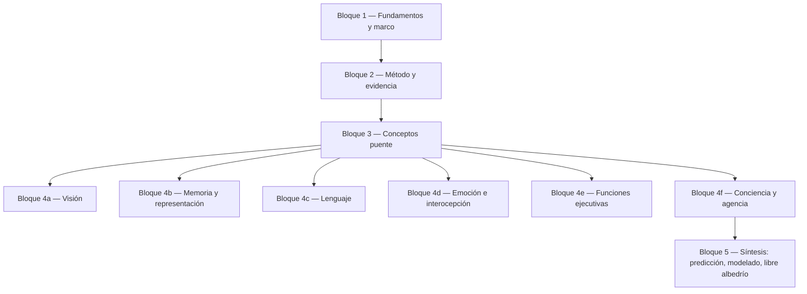

# Mapa del curso — Filosofía de las Neurociencias

> Índice navegable por bloques temáticos. Reorganiza los 16 textos centrales del curso (numeración del syllabus) y las clases trabajadas en aula, agrupándolos por bloque conceptual y proponiendo un orden de lectura útil para parcial.
>
> Convención: `Na/Nb` es el código del PDF en `Contenidos/pdf/`; los `nombre_tema.md` son las notas exegéticas en `FilosofiaDeLasNeurociencias/Explicaciones/Temas/`.

## Vista de bloques (panorama)

## Bloque 1 — Fundamentos y marco

| # | Autor | Texto (PDF) | Nota exegética en repo | Aporte |
|---|-------|-------------|------------------------|--------|
| 1 | Bechtel, Mandik & Mundale (2001) | `1 - Philosophy Meets the Neurosciences.pdf` | [[01_bechtel_mandik_mundale_filosofia_y_neurociencias]] | Define el campo; muestra por qué psicología y neurociencia no convergen automáticamente (Putnam, Fodor). |
| 2a | Daugman (2001) | `2a - Brain Metaphor and Brain Theory.pdf` | [[02_daugman_metaforas_del_cerebro]] | Las teorías del cerebro están históricamente apuntaladas en metáforas (hidráulica, telégrafo, computador). |
| 2b | Hinton (1992) | `2b - How Neural Networks Learn from Experience.pdf` | [[03_hinton_redes_neuronales]] | Introduce conexionismo, retropropagación y representación distribuida. |
| 3a | Ray | `3a - Introduction to Human Neuroscience.pdf` | [[04_ray_introduccion_a_neurociencia_humana]] | Base biológica general (neurona, sinapsis, sistemas). |
| 3b | Bickle | `3b - The Neurophilosophies of Patricia and Paul Churchland.pdf` | [[05_bickle_churchland_y_neurofilosofias]] | Sistematiza el aporte de los Churchland y el problema del eliminativismo. |

## Bloque 2 — Método y evidencia

| # | Autor | Texto | Nota | Aporte |
|---|-------|-------|------|--------|
| 4a | Bechtel (2004) | `4a - The Epistemology of Evidence in Cognitive Neuroscience.pdf` | [[01_bechtel_epistemologia_de_la_evidencia]] | Toda evidencia neurocientífica está mediada por técnicas e instrumentos. |
| 4b | Raichle (1994) | `4b - Visualizing the Mind.pdf` | [[02_raichle_visualizando_la_mente]] | Valor y límites de la neuroimagen funcional; el "default mode". |

Notas de clase asociadas (CuartaClase):

- [[01_que_es_evidencia_en_neurociencia]] — qué cuenta como evidencia
- [[02_instrumentos_intervencion_y_artefactos]] — instrumentación
- [[03_lesiones_y_deficits]] — método lesional
- [[06_localizacion_mecanismos_y_limites]] — del mapa al mecanismo

## Bloque 3 — Conceptos puente

Conceptos que cruzan los estudios de caso. Leerlos después de método/evidencia y antes de los casos.

| # | Autor | Texto | Nota | Aporte |
|---|-------|-------|------|--------|
| 13a | Bechtel (2001) | `13a - Representations. From Neural Systems to Cognitive Systems.pdf` | [[03_bechtel_representaciones]] | Defensa funcional de la noción de representación. |
| 15a | Nave et al. (2020) | `15a - Wilding the Predictive Brain.pdf` | [[02_nave_cerebro_predictivo]] | Procesamiento predictivo encarnado y extendido. |
| 11a | Chen et al. (2021) | `11a - Emerging Science of Interoception.pdf` | [[02_chen_interocepcion]] | Interocepción como base de emoción y self. |
| 5a | Ramírez-Bermúdez et al. (2024) | `5a - Neuropsychiatric Constructs as Bridges.pdf` | [[04_ramirez_bermudez_constructos_neuropsiquiatricos]] | Puente entre psicopatología y neuropatología. |

## Bloque 4 — Estudios de caso

### 4a · Visión

| # | Autor | Texto | Nota |
|---|-------|-------|------|
| 6a | Triviño-Mosquera et al. | `6a - Visión.pdf` | [[01_trivino_mosquera_vision]] |
| 6b | Zeki (1992) | `6b - The Visual Image in Mind and Brain.pdf` | [[02_zeki_imagen_visual_mente_y_cerebro]] |

### 4b · Memoria y representación

| # | Autor | Texto | Nota |
|---|-------|-------|------|
| 7a | De Brigard & Robins | (en `Material complementario`) | [[01_de_brigard_robins_memoria]] |
| 7b | Quian Quiroga | (en `pdf`) | [[02_quian_quiroga_celulas_de_la_abuela]] |
| 13b | Moser & Moser (2015) | `13b - Where Am I. Where Am I Going.pdf` | [[04_moser_moser_gps_del_cerebro]] |

### 4c · Lenguaje

| # | Autor | Texto | Nota |
|---|-------|-------|------|
| 8a | Baggio (2022) | `8a - Neurolinguistics.pdf` | (índice en [[Lenguaje/00_indice]]) |
| 8b | Hickok et al. (2001) | `8b - Sign Language in the Brain.pdf` | [[02_hickok_bellugi_klima_lenguaje_de_senas]] |

### 4d · Emoción e interocepción

| # | Autor | Texto | Nota |
|---|-------|-------|------|
| 9b | LeDoux (1994) | `9b - Emotion, Memory and the Brain.pdf` | (en EmocionInterocepcion) |
| 11a | Chen et al. (2021) | (ver bloque 3) | [[02_chen_interocepcion]] |
| 11b | Barrett (2017) | `11b - Emotion and Illness.pdf` | [[03_barrett_emocion_y_enfermedad]] |
| 5a | Ramírez-Bermúdez et al. | (ver bloque 3) | [[04_ramirez_bermudez_constructos_neuropsiquiatricos]] |

### 4e · Funciones ejecutivas y lóbulos frontales

| # | Autor | Texto | Nota |
|---|-------|-------|------|
| 12a | Suchy (2023) | `12a - Neuroscience of Executive Functioning.pdf` | [[01_suchy_funciones_ejecutivas]] |
| 12b | Miller & Cummings (2018) | `12b - The Human Frontal Lobes.pdf` | [[02_miller_cummings_lobulos_frontales]] |

### 4f · Conciencia y agencia

| # | Autor | Texto | Nota |
|---|-------|-------|------|
| 10b | Laureys (2007) | `10b - Eyes Open, Brain Shut.pdf` | [[01_laureys_estado_vegetativo]] |
| 16b | Obhi & Haggard (2004) | `16b - Free Will and Free Won't.pdf` | [[04_obhi_haggard_libre_albedrio]] |

## Bloque 5 — Síntesis: predicción, modelado y libre albedrío

Cierre integrador. Lee Nave y Webb después de tener los casos en la mano.

| # | Autor | Texto | Nota |
|---|-------|-------|------|
| 15a | Nave et al. (2020) | (ver bloque 3) | [[02_nave_cerebro_predictivo]] |
| 15b | Webb (1996) | `15b - A Cricket Robot.pdf` | [[03_webb_grillo_robot]] |
| 16b | Obhi & Haggard (2004) | (ver 4f) | [[04_obhi_haggard_libre_albedrio]] |

## Material complementario sugerido

Para ampliar el marco filosófico: Bechtel & Huang, Bechtel — *Mental Mechanisms*, Chirimuuta, Cobb.
Para repasar neurociencia general: Passingham, *Neuroanatomy Through Clinical Cases*, *The Mind's Machine*.
Para profundizar imagen, historia o psicopatología: Dehaene, *Neuroscience and Psychopathology*, *Introducción a la filosofía de las ciencias cognitivas*.

## Cómo usar este mapa

1. Si vas a leer un solo texto, lee el `1` (Bechtel-Mandik-Mundale).
2. Si tenés 1 semana, hacé Bloques 1 → 2 → 3 → un caso (Bloque 4 a tu gusto).
3. Si vas a parcial, hacé los 5 bloques en orden y usá [[01_GLOSARIO_CONCEPTOS]] y [[04_PREGUNTAS_GUIA_PARCIAL]] para autoevaluación.

Ver también: [[02_PLAN_DE_ESTUDIO]] (secuencia con tiempos), [[03_RESUMENES_POR_AUTOR]] (posición + objeciones por autor).
