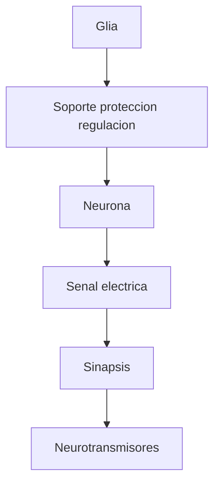

# Indice - tercera clase

Esta carpeta organiza las explicaciones celulares basicas del cerebro.

## Formato usado

Estos apuntes usan:

- bloques `mermaid` para diagramas
- expresiones `LaTeX` cuando conviene resumir una relacion simple

Si tu visor de Markdown soporta diagramas, deberias verlos renderizados. Si no, al menos queda el codigo legible.

## Orden sugerido

1. [01_neuronas.md](01_neuronas.md)
2. [02_astrocitos.md](02_astrocitos.md)
3. [03_oligodendrocitos_y_mielina.md](03_oligodendrocitos_y_mielina.md)
4. [04_microglia.md](04_microglia.md)
5. [05_sinapsis_y_neurotransmisores.md](05_sinapsis_y_neurotransmisores.md)
6. [glosario_clase.md](glosario_clase.md)
7. [07_sistema_nervioso_central_y_periferico.md](07_sistema_nervioso_central_y_periferico.md)
8. [08_orientacion_neuroanatomica.md](08_orientacion_neuroanatomica.md)
9. [09_ventriculos_liquido_cefalorraquideo_e_hidrocefalia.md](09_ventriculos_liquido_cefalorraquideo_e_hidrocefalia.md)
10. [10_sustancia_gris_y_sustancia_blanca.md](10_sustancia_gris_y_sustancia_blanca.md)
11. [11_lobulos_cerebrales.md](11_lobulos_cerebrales.md)
12. [12_surcos_giros_y_otras_formas_de_describir_la_corteza.md](12_surcos_giros_y_otras_formas_de_describir_la_corteza.md)
13. [13_homunculo_motor_y_somatosensorial.md](13_homunculo_motor_y_somatosensorial.md)
14. [14_representaciones_multimodalidad_y_flujo.md](14_representaciones_multimodalidad_y_flujo.md)
15. [15_ganglios_basales_talamo_e_insula.md](15_ganglios_basales_talamo_e_insula.md)
16. [16_aprendizaje_plasticidad_e_ideas_previas_del_cerebro.md](16_aprendizaje_plasticidad_e_ideas_previas_del_cerebro.md)
17. [17_automatizacion_y_conciencia.md](17_automatizacion_y_conciencia.md)

## Idea general

Para entender el cerebro primero conviene distinguir tres cosas:

- quien transmite la informacion: `la neurona`
- quien sostiene, protege y regula ese trabajo: `la glia`
- como pasa la informacion de una celula a otra: `la sinapsis`

