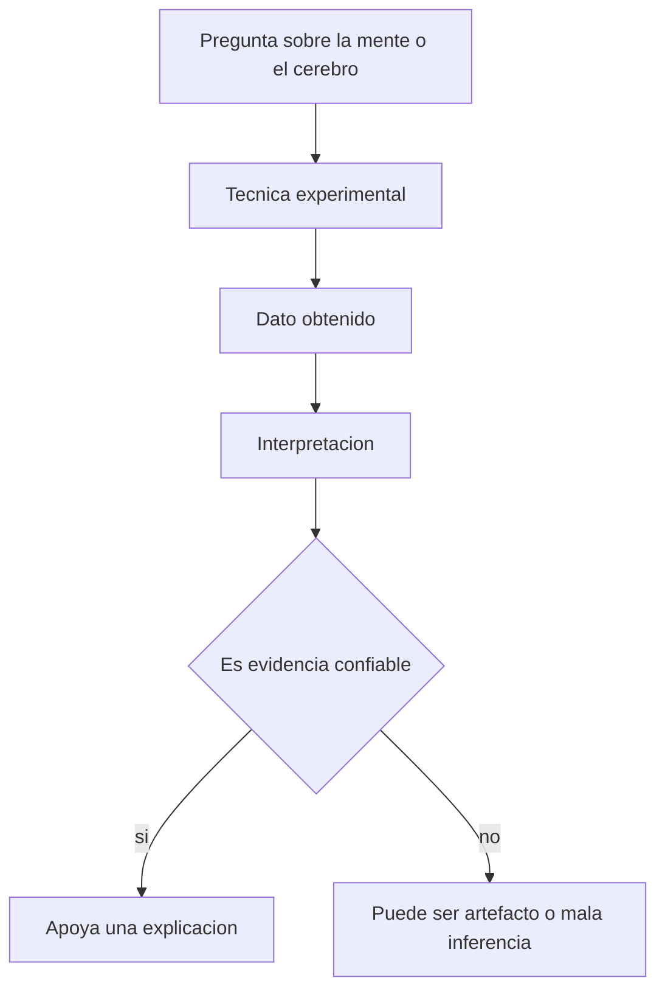

# Indice - cuarta clase

Esta carpeta organiza notas de ayuda sobre la cuarta clase del curso, correspondiente a `Epistemologia de la evidencia`.

## Orden sugerido

1. [01_que_es_evidencia_en_neurociencia.md](01_que_es_evidencia_en_neurociencia.md)
2. [02_instrumentos_intervencion_y_artefactos.md](02_instrumentos_intervencion_y_artefactos.md)
3. [03_lesiones_y_deficits.md](03_lesiones_y_deficits.md)
4. [04_registro_unicelular_y_respuesta_neuronal.md](04_registro_unicelular_y_respuesta_neuronal.md)
5. [05_pet_fmri_y_neuroimagen_funcional.md](05_pet_fmri_y_neuroimagen_funcional.md)
6. [06_localizacion_mecanismos_y_limites.md](06_localizacion_mecanismos_y_limites.md)
7. [glosario_clase.md](glosario_clase.md)
8. [00_notas.md](00_notas.md)

## Idea general

La clase no trata solo de `que dice la neurociencia`, sino de `como llega a decirlo`.

La pregunta central es esta:

**Cuando vemos un resultado experimental, como sabemos que eso cuenta realmente como evidencia y no como un efecto producido por la tecnica misma?**

