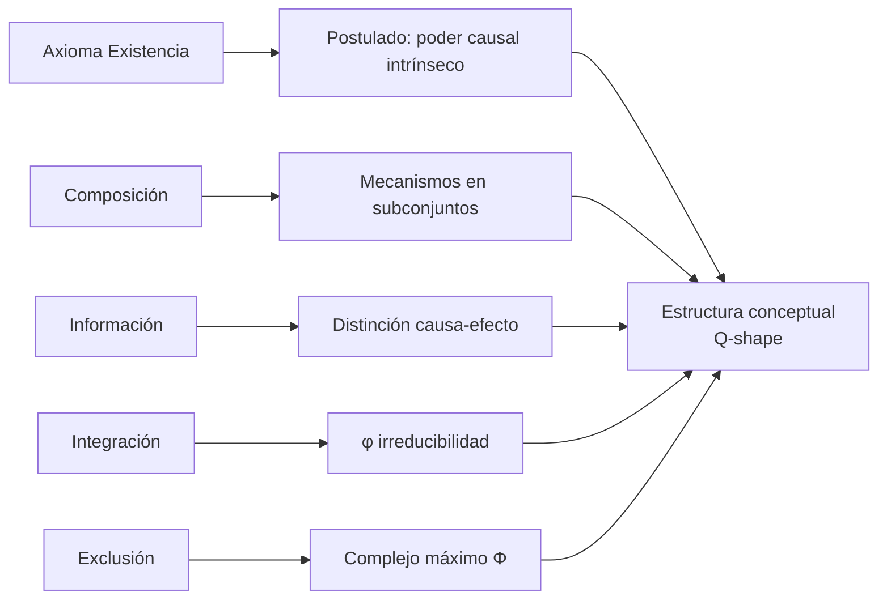
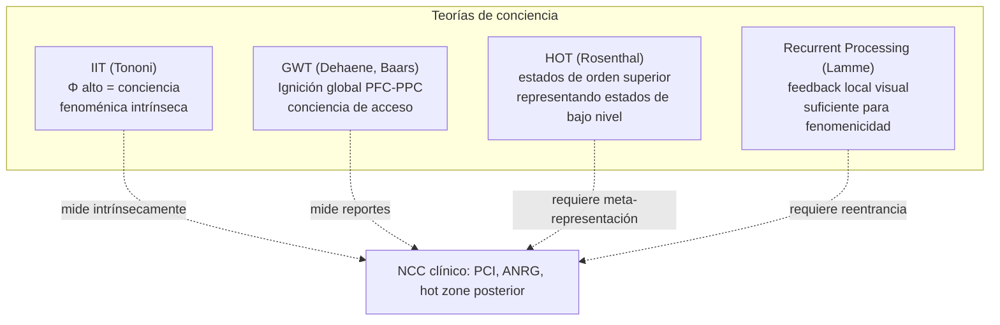

# IIT formal de Tononi: axiomas, postulados y Φ

> **Tema sin PDF dedicado en el corpus.** Nota explicativa para cubrir la
> Teoría de la Información Integrada (IIT 3.0/4.0) de Giulio Tononi.
> Cross-refs: [[01_laureys_estado_vegetativo]] (NCC clínico),
> [[02_nave_cerebro_predictivo]] (marco computacional contrapuesto),
> [[08_cerebro_predictivo_y_formalizacion]] (modelos formales rivales).

## 1. Punto de partida: el método fenomenológico-axiomático

Lo distintivo de IIT frente a Global Workspace Theory (GWT) o Higher-Order
Thought (HOT) es la **dirección inferencial**: parte de propiedades
fenomenológicas indubitables de cualquier experiencia consciente
(*axiomas*) y exige que el sustrato físico de la conciencia las satisfaga
(*postulados*). No es una teoría de "qué hace el cerebro consciente sino
una de qué tiene que ser un sistema para serlo".

### Los cinco axiomas (IIT 3.0, refinados en 4.0)

1. **Existencia (intrinsic existence)**: la experiencia existe para sí
   misma, no relativa a un observador externo. Operativamente: el sistema
   debe tener poder causal *intrínseco* — capacidad de hacer-diferencia
   sobre sí mismo.
2. **Composición (composition)**: la experiencia es estructurada —
   contiene fenoménicamente múltiples distinciones (un libro azul a la
   izquierda, un sonido a la derecha). El sustrato debe componer
   subconjuntos causalmente relevantes.
3. **Información (information)**: cada experiencia es *específica* —
   distinta de innumerables otras posibles. El estado actual del sistema
   excluye un conjunto de estados alternativos posibles.
4. **Integración (integration)**: la experiencia es *unificada* — no
   reducible a la suma de experiencias parciales. El sistema debe
   exhibir información integrada irreducible a sus particiones.
5. **Exclusión (exclusion)**: la experiencia tiene fronteras definidas —
   ni más ni menos contenido del que tiene, en una grain temporal-espacial
   específica. El sustrato debe ser el **complejo de máximo Φ** dentro de
   su espacio.

## 2. Postulados: traducción al sustrato físico

Cada axioma se traduce en un requisito sobre **mecanismos** (elementos
con estados causales discretos):

## 3. Φ y el cálculo conceptual

Sea $S$ un sistema de mecanismos en un estado $s_0$. Para cada subconjunto
de mecanismos $M \subseteq S$ se define el **concepto** asociado:

- **Repertorio causa**: distribución sobre estados pasados que pudieron
  haber producido $s_0|_M$.
- **Repertorio efecto**: distribución sobre estados futuros que $s_0|_M$
  produce.

La **integración del mecanismo** ($\varphi$, "pequeño phi") se mide como
la distancia mínima al particionar $M$ en dos partes con un *cut*
unidireccional:

$$
\varphi(M, s_0) = \min_{\text{partition } P} D\big(p_{\text{cause-effect}}(M,s_0) \,\|\, p_{\text{cause-effect}}^{P}(M,s_0)\big)
$$

donde $D$ es la *Earth Mover's Distance* (IIT 3.0) o *integrated
information measure* basada en intrínseca-difference (IIT 4.0).

El **Φ del sistema** ("phi grande") es la irreducibilidad de la
**estructura conceptual completa** $C(S, s_0) = \{(M, \varphi, \text{repertorios}) : M \subseteq S\}$
frente a una **partición unidireccional minimal** del sistema entero:

$$
\Phi(S, s_0) = D\big(C(S, s_0) \,\|\, C^{MIP}(S, s_0)\big)
$$

donde MIP es *Minimum Information Partition*.

### Ejemplo con 3 neuronas (sistema mínimo no trivial)

Considere $N_1, N_2, N_3$ binarias (estado 0/1) con la siguiente matriz
de conexión (`COPY/AND/XOR`):

| neurona | función | inputs |
|---------|---------|--------|
| $N_1$ | COPY | $N_3$ |
| $N_2$ | AND  | $N_1, N_3$ |
| $N_3$ | XOR  | $N_1, N_2$ |

Estado actual $s_0 = (1,0,1)$. Calculamos:

1. **TPM (transition probability matrix)** $2^3 \times 2^3$ a partir de
   las funciones. Cada fila suma 1.
2. Para cada $M \in \{\{N_1\},\{N_2\},\{N_3\},\{N_1,N_2\},\ldots,\{N_1,N_2,N_3\}\}$
   se calcula el repertorio causa-efecto.
3. Para cada $M$ se busca la partición $P^*$ que minimiza la distancia y
   se obtiene $\varphi(M)$. Mecanismos con $\varphi=0$ (i.e. reducibles)
   se descartan.
4. Se construye $C$ y se busca la **MIP del sistema entero** (8 posibles
   particiones unidireccionales no triviales en 3 elementos). La que
   menos cambia la estructura conceptual define $\Phi$.

En un sistema XOR-AND-COPY como el anterior, $\Phi > 0$ por la presencia
del XOR, que es la operación canónicamente *no factorizable* — separar
cualquiera de sus inputs destruye información que existe sólo en su
conjunción. Una red puramente feed-forward de COPYs daría $\Phi = 0$ aun
con muchísimas neuronas: ése es el punto.

## 4. Complejo principal y exclusión

El **complejo principal** es el subconjunto $S^* \subseteq U$ del universo
físico que maximiza $\Phi$ y *excluye* a todos los $\Phi$ de
subconjuntos contenidos o superconjuntos. Consecuencias:

- Mi conciencia "vive" en el complejo principal de mi cerebro
  (probablemente cortex + tálamo posterior, "hot zone" posterior).
- El cerebelo, pese a tener 4× más neuronas que la corteza, tiene $\Phi$
  bajo por su arquitectura modular feed-forward — explica por qué
  lesiones cerebelares no abolen conciencia.
- Sistemas split-brain: cada hemisferio puede convertirse en complejo
  principal independiente (Sperry).

## 5. Predicciones empíricas y NCC

- **Perturbational Complexity Index (PCI)**: Massimini *et al.* (2009,
  2013) operacionalizan IIT con TMS + EEG. PCI distingue vigilia/REM
  (alto) de sueño profundo/anestesia/coma vegetativo (bajo), incluso en
  pacientes que no muestran respuestas conductuales. Predicción IIT
  *confirmada* en sentido fuerte.
- **Hot zone posterior**: cortex parietal-occipital-temporal sería el
  complejo principal, no la corteza prefrontal (esto choca con GWT).
  Apoyo: contenido perceptual disociable de reportabilidad.
- **Apagones perceptuales en visión binocular rivalry** correlacionan con
  cambios en integración informacional medida sobre M/EEG.

## 6. Críticas y posiciones encontradas

| Crítica | Quién | Respuesta IIT |
|---------|-------|---------------|
| **Panpsiquismo de facto**: cualquier sistema con $\Phi>0$ es consciente, incluyendo termostatos, diodos, fotodiodos en cascada. | Aaronson (2014), Searle | Tononi lo asume: IIT es metafísicamente panpsiquista pero la *cantidad* de experiencia escala con $\Phi$. Aaronson construye expansores con $\Phi$ astronómico y conciencia intuitivamente nula → IIT lo muerde como bala. |
| **Computacionalmente intratable**: cálculo exacto de $\Phi$ es NP-hard (cantidad de particiones crece super-exponencial). | Tegmark, Cerullo | Aproximaciones (PyPhi, $\Phi^*$ medidas) que sacrifican exactitud por tratabilidad. Crítica de fondo: si ni siquiera podemos computar $\Phi$ para un nematodo de 302 neuronas, ¿qué *significa* la teoría? |
| **No-mecanicismo**: IIT toma como primitivo "poder causal intrínseco" sin reducirlo a procesos mecanísticos descomponibles. | Bechtel, Chirimuuta | IIT replica que el mecanicismo asume el explanandum (existencia subjetiva) y sólo describe el sustrato físico — IIT lo *deriva* axiomáticamente. |
| **GWT da mejores predicciones de reportabilidad**: ignición tardía PFC + acceso global. | Dehaene, Mashour | IIT distingue conciencia *fenoménica* (Φ) de conciencia de *acceso* (broadcast); ambas teorías miden cosas distintas. Convergen en el experimento [adversarial collaboration 2019-2025 Cogitate]. |
| **"Falsa unidad"**: la integración matemática no es la unidad fenomenológica genuina. | Pautz, Bayne | Discusión filosófica abierta. |

## 7. Conexión con GWT y otras teorías

El proyecto **Cogitate** (consorcio Templeton 2019-2025) testeó
predicciones discriminantes entre IIT y GWT con M/EEG, iEEG y fMRI. El
resultado preliminar (2023 preprint, 2025 publicación): *ninguna sale
completamente confirmada*. GWT predice mejor la ignición PFC; IIT
predice mejor la persistencia del contenido posterior. La discusión
sigue activa.

## 8. Lectura mínima recomendada

- Tononi, G. (2008). *Consciousness as Integrated Information: a
  Provisional Manifesto*. *Biological Bulletin*, 215(3), 216-242.
- Oizumi, M., Albantakis, L., Tononi, G. (2014). *From the Phenomenology
  to the Mechanisms of Consciousness: IIT 3.0*. *PLoS Comput Biol*.
- Albantakis, L. *et al.* (2023). *IIT 4.0: Formulating the Properties of
  Phenomenal Existence in Physical Terms*. *PLoS Comput Biol*.
- Aaronson, S. (2014). *Why I Am Not An Integrated Information
  Theorist*. (Blog post — crítica computacional canónica.)
- Massimini, M. *et al.* (2013). *A Theoretically Based Index of
  Consciousness Independent of Sensory Processing and Behavior*.
  *Science Translational Medicine*.

---

*Cross-refs internos*: [[01_laureys_estado_vegetativo]] usa PCI
como herramienta diagnóstica derivada de IIT.
[[02_nave_cerebro_predictivo]] presenta el rival predictivo (Friston,
active inference) que NO requiere $\Phi$. [[08_cerebro_predictivo_y_formalizacion]]
contrasta los formalismos de ambas familias.
