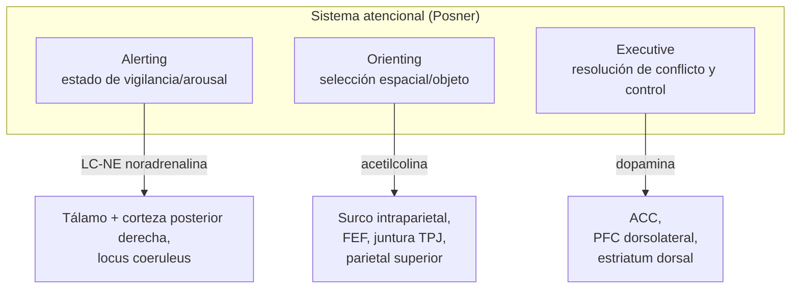
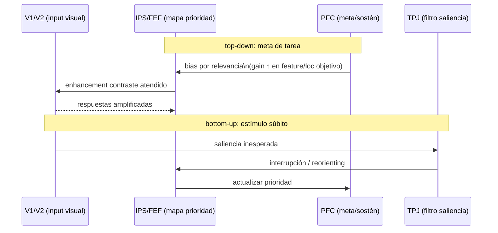

# Atención según Posner: tres redes y modulación predictiva

> **Tema sin PDF dedicado en el corpus.** Nota explicativa del modelo
> de Michael Posner sobre los sistemas atencionales y su evolución hacia
> teorías predictivas. Cross-refs:
> [[01_suchy_funciones_ejecutivas]] (atención ejecutiva ≈ control),
> [[02_nave_cerebro_predictivo]] (precision-weighting bayesiano),
> [[02_miller_cummings_lobulos_frontales]] (anatomía PFC/ACC).

## 1. Punto de partida: atención como sistema de sistemas

Posner (1971-) rompe con la idea de "atención" como una facultad única.
Su tesis empírica, cristalizada en Posner & Petersen (1990) y refinada
en Petersen & Posner (2012), es que existen **tres redes neurales
disociables anatómica, neuroquímica y funcionalmente**: alerta
(*alerting*), orientación (*orienting*) y control ejecutivo
(*executive control*). Cada una se puede dañar, modular farmacológicamente
y entrenar de modo independiente.

## 2. Las tres redes

### 2.1. Alerting (alerta tónica y fásica)

- **Función**: sostener estado de vigilancia y elevarlo transitoriamente
  ante señales de advertencia ("warning cue").
- **Anatomía**: locus coeruleus (núcleo noradrenérgico del tronco) →
  proyecciones difusas al cortex posterior, particularmente derecho.
- **Neuroquímica**: noradrenalina (NE). Bloqueo NE → caída de la alerta
  fásica.
- **Marker conductual**: en la ANT (Attention Network Test) la diferencia
  RT *no-cue* − *double-cue*.

### 2.2. Orienting (selectivo, espacial o por features)

- **Función**: priorizar una localización o un objeto frente a otros
  (selección).
- **Anatomía**: red parietal dorsal (IPS, FEF) para orienting
  voluntario *endógeno*; red ventral (TPJ, IFG derecho — Corbetta &
  Shulman 2002) para captura *exógena* (cue periférico súbito).
- **Neuroquímica**: acetilcolina (núcleo basal de Meynert; sistema
  colinérgico).
- **Marker conductual**: en la ANT, RT *spatial-cue* vs *center-cue*
  (efecto válido vs neutral).

### 2.3. Executive (resolución de conflicto y control)

- **Función**: monitorear conflicto, detectar errores, sostener metas
  ante interferencia (Stroop, flankers).
- **Anatomía**: ACC dorsal + PFC dorsolateral (núcleo del modelo de
  Posner). Conectividad con estriado dorsal.
- **Neuroquímica**: dopamina (mesocortical).
- **Marker conductual**: en la ANT, RT *incongruent* − *congruent*
  (efecto flanker).

## 3. La tarea ANT como ensamblaje minimal

La **Attention Network Test** (Fan, McCandliss, Sommer, Raz, Posner
2002) mide las tres redes en un solo paradigma. Cada ensayo combina un
*cue* (none / center / double / spatial) con un *target* (flecha
central flanqueada por congruentes / incongruentes / neutrales).
Operacionalizaciones:

$$
\text{Alerting} = \mathrm{RT}_{\text{no-cue}} - \mathrm{RT}_{\text{double-cue}}
$$

$$
\text{Orienting} = \mathrm{RT}_{\text{center-cue}} - \mathrm{RT}_{\text{spatial-cue}}
$$

$$
\text{Executive} = \mathrm{RT}_{\text{incongruent}} - \mathrm{RT}_{\text{congruent}}
$$

Las tres puntuaciones presentan correlaciones internas bajas (~0.0-0.2):
**evidencia de disociación funcional**, consistente con redes
anatómicamente separadas.

## 4. Modulación top-down vs bottom-up

- **Top-down (endógeno)**: PFC → IPS/FEF imponen un *priority map* que
  amplifica la ganancia de las representaciones objetivo en V1-V4
  (Reynolds & Heeger 2009, normalization model of attention).
- **Bottom-up (exógeno)**: estímulos salientes (alto contraste, novedad)
  reclutan TPJ derecho que actúa como "circuit breaker" interrumpiendo
  el set actual (Corbetta, Patel & Shulman 2008).

## 5. Atención vs conciencia: ¿disociables?

Posición clásica (Posner 1994): la atención es el **gating** que
selecciona qué llega a la conciencia. Posiciones contemporáneas:

| Posición | Autores | Tesis |
|----------|---------|-------|
| Atención necesaria y suficiente | Posner, Mack & Rock | Inattentional blindness y change blindness sugieren no-atención → no-conciencia. |
| Disociables | Koch & Tsuchiya (2007) | Hay atención sin conciencia (priming subliminal con cueing) y conciencia sin atención (gist, escenas naturales). |
| Atención modula precisión bayesiana | Friston, Hohwy | La atención = *gain* sobre la precisión de error de predicción; conciencia = otra cosa (inferencia de alto nivel, Markov blanket). |

## 6. Atención como precision-weighting (cerebro predictivo)

La reformulación predictiva (Feldman & Friston 2010) reinterpreta a
Posner:

$$
\text{Update}_{\text{posterior}} \propto \pi_{\text{likelihood}} \cdot \varepsilon_{\text{predicción}}
$$

donde $\pi$ es la **precisión** (inverso de varianza) asignada a la
señal sensorial. La atención no aumenta la señal: aumenta su
**precisión**, ponderando más fuerte el error de predicción asociado.
Esto unifica las tres redes de Posner:

- **Alerting** = elevar $\pi$ global (NE).
- **Orienting** = elevar $\pi$ espacial selectiva (ACh).
- **Executive** = elevar $\pi$ del modelo de tarea sobre interferencia
  (DA).

Predicción operacional: con farmacología selectiva (atomoxetina ↑NE,
donepecilo ↑ACh, metilfenidato ↑DA/NE) cada red se modula
diferencialmente — replicado parcialmente.

## 7. Posiciones encontradas

| Debate | Posición A | Posición B |
|--------|------------|------------|
| **Modularidad fuerte de las 3 redes** | Posner, Petersen: redes anatómica y químicamente separadas. | Awh, Belopolsky, Theeuwes (2012): la dicotomía top-down/bottom-up es insuficiente; el "*selection history*" (priming, recompensa) es una tercera fuente igualmente potente. |
| **ACC = conflicto vs energización** | Botvinick, Carter, Cohen: ACC detecta conflicto y reclama control PFC. | Shenhav, Botvinick, Cohen (2013): ACC evalúa costos/beneficios del esfuerzo cognitivo (Expected Value of Control, EVC). |
| **Alerting es módulo o estado**? | Posner: red separada. | Sara & Bouret (2012): LC-NE no es atención, es **arousal/saliencia** subyacente a varias funciones. |
| **Atención = conciencia?** | Mack, Posner: sí, prácticamente. | Koch, Tsuchiya: no, doblemente disociables. |

## 8. Implicaciones clínicas

- **TDAH**: déficit primario en red ejecutiva (resolución de conflicto)
  + componente de alerting; metilfenidato compensa parcialmente.
- **Neglect hemispatial**: lesión parietal/TPJ derecha → red de
  orientación rota; el paciente "no atiende" el hemicampo izquierdo
  aunque V1 esté intacto.
- **Delirium hiperactivo**: alerta exagerada con orientación errática;
  fallo prefrontal de control sobre el LC-NE.
- **Enfermedad de Alzheimer temprana**: pérdida colinérgica del núcleo
  basal de Meynert → red de orientación selectiva degradada antes que
  funciones mnésicas explícitas (controvertido).

## 9. Lectura mínima recomendada

- Posner, M. I., & Petersen, S. E. (1990). *The attention system of the
  human brain*. *Annual Review of Neuroscience*, 13, 25-42.
- Petersen, S. E., & Posner, M. I. (2012). *The attention system of the
  human brain: 20 years after*. *Annual Review of Neuroscience*, 35, 73-89.
- Fan, J., McCandliss, B., Sommer, T., Raz, A., Posner, M. I. (2002).
  *Testing the Efficiency and Independence of Attentional Networks*.
  *Journal of Cognitive Neuroscience*, 14(3), 340-347.
- Corbetta, M., & Shulman, G. L. (2002). *Control of goal-directed and
  stimulus-driven attention in the brain*. *Nature Reviews Neuroscience*,
  3, 201-215.
- Feldman, H., & Friston, K. J. (2010). *Attention, Uncertainty, and
  Free-Energy*. *Frontiers in Human Neuroscience*, 4:215.

---

*Cross-refs internos*: [[01_suchy_funciones_ejecutivas]] desarrolla la
red ejecutiva. [[02_miller_cummings_lobulos_frontales]] cubre lesiones
PFC con caída de control atencional. [[02_nave_cerebro_predictivo]]
muestra el formalismo en el que se reabsorbe atención como precisión.
[[04_obhi_haggard_libre_albedrio]] usa paradigmas atencionales para
explorar agencia.
