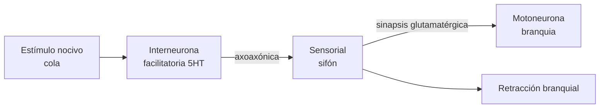
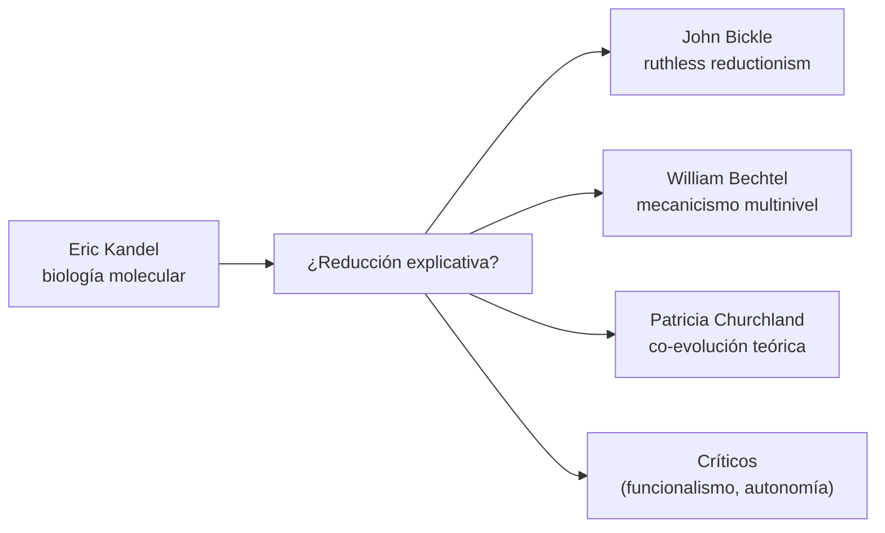

# Kandel y el reduccionismo molecular de la memoria

> **Tema sin PDF dedicado en el corpus.** Nota explicativa sobre el
> programa de Eric Kandel: usar invertebrados (Aplysia) para reducir la
> memoria a cascadas moleculares de plasticidad sináptica, y el debate
> filosófico que abre con Bickle, Bechtel y Churchland.
> Cross-refs: [[05_bickle_churchland_y_neurofilosofias]] (reducción
> ruthless), [[01_bechtel_mandik_mundale_filosofia_y_neurociencias]]
> (mecanicismo multinivel), [[04_memoria_representacion_y_espacio]]
> (memoria como representación), [[02_bechtel_mental_mechanisms]]
> (mecanismos mentales).

## 1. La apuesta de Kandel

Kandel formula en los años 60 una apuesta heterodoxa: si la memoria es
un fenómeno biológico universal, su mecanismo debe ser conservado
evolutivamente — y por tanto investigable en un sistema **molecular y
celularmente tratable**, no en el cerebro humano. Escoge *Aplysia
californica*, una babosa marina con ~20.000 neuronas grandes,
identificables individualmente, y un repertorio conductual mínimo pero
modificable: el reflejo de retracción de la branquia/sifón.

Esto le permite hacer algo que en mamíferos era imposible: **registrar
de la misma sinapsis** antes y después de aprendizaje, manipularla
farmacológica y genéticamente, y conectar comportamiento ↔ molécula
en una línea causal explícita. Premio Nobel 2000.

## 2. Habituación, sensitización y condicionamiento clásico en *Aplysia*

Tres formas básicas de aprendizaje implícito, todas observables en el
mismo circuito:



| Aprendizaje | Estímulo | Cambio sináptico | Mecanismo |
|-------------|----------|------------------|-----------|
| Habituación | sifón solo, repetido | depresión homosináptica | depleción de vesículas glutamato, ↓ Ca²⁺ presináptico |
| Sensitización corto plazo | shock cola (1×) | facilitación 15-60 min | 5HT → AMPc → PKA → fosforilación K⁺ canal, ↑ liberación |
| Sensitización largo plazo | shock cola (5×) | facilitación >24h, nuevas sinapsis | PKA → CREB-1 (activador) y −CREB-2 (represor), transcripción, crecimiento sináptico |

## 3. La cascada molecular del LTF (long-term facilitation)

```mermaid
sequenceDiagram
  participant 5HT as Interneurona 5HT
  participant R as Receptor 5HT
  participant AC as Adenilato ciclasa
  participant AMPc as cAMP
  participant PKA as PKA
  participant CREB as CREB-1/CREB-2
  participant TX as Transcripción
  participant SYN as Nuevas sinapsis

  5HT->>R: serotonina
  R->>AC: G-proteína Gs
  AC->>AMPc: ATP → cAMP
  AMPc->>PKA: liberación de subunidades catalíticas
  Note over PKA: corto plazo:\nfosforila K+ canales y aumenta\nliberación de glutamato
  PKA->>CREB: si shock se repite,\nentra al núcleo
  CREB->>TX: CREB-1 activa,\nCREB-2 reprime; balance regula umbral
  TX->>SYN: ubiquitina-hidrolasa, C/EBP,\ngenes inmediato-tempranos →\nsíntesis proteica, crecimiento
```

Predicción operacional cumplida: bloquear síntesis proteica
(anisomicina) o transcripción (actinomicina D) entre 0-3h post-entrenamiento
**abole la fase larga sin tocar la corta** — disociación
farmacológica que canoniza la distinción STM/LTM molecularmente.

## 4. Generalización a mamíferos: LTP en hipocampo

Bliss & Lømo (1973) descubren en hipocampo de conejo la **potenciación
de larga duración (LTP)**: estimulación tetánica de fibras perforantes
→ aumento sostenido (horas-días) de la respuesta postsináptica en
granulares del giro dentado. Propiedades:

- **Cooperatividad**: requiere estimulación de múltiples fibras.
- **Asociatividad**: tetanización débil + fuerte concurrente potencia
  ambas (sustrato hebbiano).
- **Especificidad de input**: sinapsis no activas no se potencian.

Mecanismo (en sinapsis CA3-CA1, las más estudiadas):

$$
\text{LTP}_{\text{inducción}} : \text{Glu} \to \text{NMDA-R}\ \xrightarrow{\text{despolar.}}\ \text{Mg}^{2+}\ \text{out} \to \text{Ca}^{2+}\ \text{in} \to \text{CaMKII / PKC}
$$

$$
\text{LTP}_{\text{mantenimiento, fase tardía}}: \text{PKA} \to \text{CREB} \to \text{síntesis proteica} \to \text{nuevos AMPA-R, espinas dendríticas}
$$

LTD (long-term depression) usa la **misma vía NMDA pero con
estimulación de baja frecuencia** y entrada moderada de Ca²⁺ →
desfosforilación neta (fosfatasas PP1/calcineurina) → retiro de AMPA-R.

La **regla de plasticidad de Bienenstock-Cooper-Munro (BCM)** captura
la dependencia bidireccional de la actividad postsináptica:

$$
\frac{dw_{ij}}{dt} = \eta\ x_i\ \phi(y_j, \theta_M)
$$

con $\phi$ negativa para $y_j < \theta_M$ (LTD) y positiva para
$y_j > \theta_M$ (LTP), siendo $\theta_M$ un umbral móvil que crece con
la actividad media (metaplasticidad, homeostasis sináptica).

## 5. Memoria = plasticidad? La tesis fuerte

Kandel (2001, *Science* "The molecular biology of memory storage: a
dialogue between genes and synapses") sostiene:

> "Las modificaciones a largo plazo de la fuerza sináptica son la
> instancia celular del aprendizaje, y los cambios en la expresión
> génica son la instancia molecular del paso de memoria de corto a
> largo plazo."

Esta es una afirmación **reduccionista explícita**: memoria como
fenómeno cognitivo *es* (o se constituye por) cambios moleculares en
sinapsis específicas.

## 6. El debate filosófico: ¿qué tipo de reducción?



### 6.1. Bickle: *ruthless reductionism*

Bickle (*Philosophy and Neuroscience: A Ruthlessly Reductive Account*,
2003) lee a Kandel como el caso ejemplar de **reducción ontológica
implacable** (sin remordimientos). Su tesis:

- Los modelos psicológicos (memoria, atención, aprendizaje asociativo)
  son **borradores heurísticos** que serán reemplazados por descripciones
  moleculares-celulares cuando éstas estén disponibles.
- No hay "explicación a nivel cognitivo" autónoma: hay una **cadena de
  intervenciones experimentales** (knockout CREB en ratón → fenotipo
  conductual mnésico) que define el explanans real.
- La intertheoretic reduction de Nagel queda obsoleta: la
  neurociencia molecular no *deriva* las leyes psicológicas, las
  **explica away**.

### 6.2. Bechtel: mecanicismo multinivel sin eliminación

Bechtel (*Mental Mechanisms*, 2008; *Discovering Cell Mechanisms*) ofrece
una lectura **opuesta**:

- Explicar memoria es **descomponer un mecanismo** en operaciones y
  partes a múltiples niveles (sistémico → celular → molecular).
- Cada nivel es genuinamente explicativo y no eliminable: el nivel
  molecular sin el contexto del circuito (qué sinapsis, en qué
  comportamiento) no explica nada cognitivo.
- "Looking down" (molecular) y "looking around" (sistémico) son
  estrategias complementarias, no rivales.
- Kandel mismo, leído con atención, hace mecanicismo multinivel:
  *Aplysia* es elegante porque conecta los tres niveles **en el mismo
  preparado**.

### 6.3. Patricia Churchland: co-evolución teórica

Churchland (*Neurophilosophy*, 1986) propuso un punto medio: las teorías
psicológicas y neurobiológicas **co-evolucionan**, refinándose
mutuamente. Ni reducción nageliana clásica ni autonomía funcionalista.
Kandel-LTP es el caso emblemático: la psicología del condicionamiento
(Pavlov, Skinner) sugirió qué buscar; la molecular reformuló qué cuenta
como "memoria" (memoria implícita ≠ explícita; episódica ≠ semántica;
trabajo ≠ corto plazo).

### 6.4. Críticos: el funcionalismo y la realización múltiple

| Crítica | Argumento |
|---------|-----------|
| **Realización múltiple** (Fodor, Putnam) | Memoria puede realizarse en silicio, redes neurales artificiales, etc. → reducción a "esta molécula" es chauvinismo carbono. |
| **Pérdida de patrones cognitivos** (Hutto, Myin) | Mirar moléculas pierde la estructura sintáctica/semántica de la memoria episódica narrativa (no se "lee" en CREB qué recordó el sujeto). |
| **Confusión nivel sub-personal/personal** (Dennett) | Plasticidad explica el sustrato pero no constituye "recordar" como acto personal con contenido. |
| **Granularidad y holismo** (Chirimuuta) | Reducciones biológicas son útiles pero brain mechanisms son abstracciones idealizadas; lo "molecular" oculta variabilidad sistémica. |

## 7. Qué se gana, qué se pierde

| Se gana | Se pierde |
|---------|-----------|
| Intervención causal precisa (knockouts CREB, optogenética). | Vocabulario fenomenológico ("recordar" como acto situado). |
| Predicción farmacológica (anisomicina abole LTM). | Conexión con narrativa autobiográfica y sentido. |
| Unidad explicativa cross-species (de Aplysia a humano). | Heterogeneidad de tipos de memoria (semántica, autobiográfica). |
| Replicabilidad experimental. | Distinción persona/cerebro (Dennett). |
| Sustrato común para LTP/LTD/memoria/adicción. | Riesgo de cosificar metáfora ("la memoria está en la sinapsis"). |

## 8. Estado contemporáneo (post-Kandel)

- **Engrama**: técnicas optogenéticas (Tonegawa, Josselyn 2010-2020)
  permiten **identificar y reactivar** poblaciones específicas de
  neuronas marcadas durante el aprendizaje (e.g. expresión de c-fos),
  produciendo recuerdo "artificial" en ausencia del estímulo original.
  Esto fortalece la tesis molecular pero la complica: el engrama es
  **distribuido y dependiente del contexto**, no localizable en una
  sinapsis.
- **Reconsolidación**: cada vez que una memoria se reactiva, se vuelve
  lábil por horas y requiere nueva síntesis proteica para reestabilizarse
  (Nader, Schafe, LeDoux 2000). Esto abre terapéutica para PTSD
  (propranolol durante reconsolidación) y refuta la imagen estática de
  "memoria fija en sinapsis".
- **Astrocitos y matriz extracelular**: la plasticidad no es sólo
  sináptica neuronal — glia y perineuronal nets modulan ventanas
  críticas.

## 9. Lectura mínima recomendada

- Kandel, E. R. (2001). *The Molecular Biology of Memory Storage: A
  Dialogue Between Genes and Synapses*. *Science*, 294(5544), 1030-1038.
- Kandel, E. R. (2006). *In Search of Memory: The Emergence of a New
  Science of Mind*. W. W. Norton. (Autobiografía intelectual.)
- Bickle, J. (2003). *Philosophy and Neuroscience: A Ruthlessly
  Reductive Account*. Springer.
- Bechtel, W. (2008). *Mental Mechanisms: Philosophical Perspectives on
  Cognitive Neuroscience*. Routledge.
- Bliss, T. V. P., & Collingridge, G. L. (1993). *A synaptic model of
  memory: long-term potentiation in the hippocampus*. *Nature*, 361,
  31-39.
- Nader, K., Schafe, G., LeDoux, J. (2000). *Fear memories require
  protein synthesis in the amygdala for reconsolidation after
  retrieval*. *Nature*, 406, 722-726.

---

*Cross-refs internos*: [[05_bickle_churchland_y_neurofilosofias]] da el
marco filosófico explícito. [[01_bechtel_mandik_mundale_filosofia_y_neurociencias]]
desarrolla el mecanicismo multinivel. [[04_memoria_representacion_y_espacio]]
muestra la memoria como representación a nivel sistémico.
[[02_bechtel_mental_mechanisms]] es el texto base del mecanicismo
explicativo aplicado a memoria.
