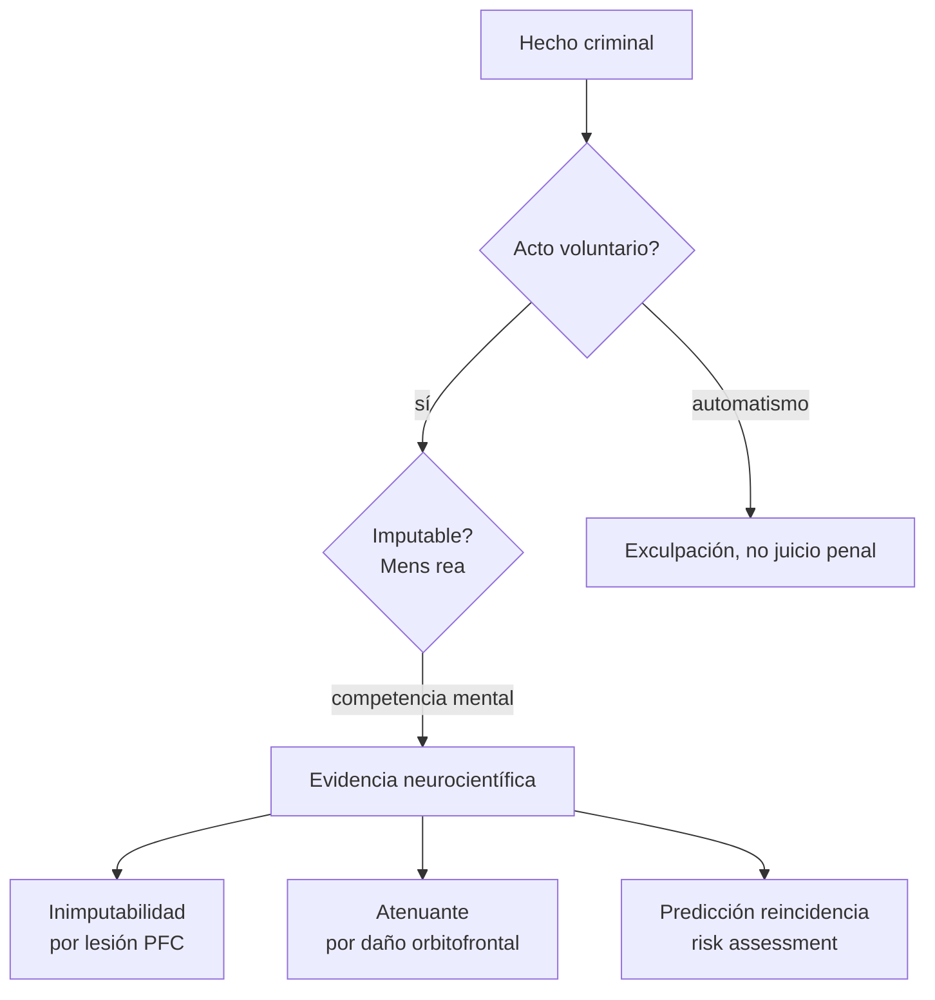
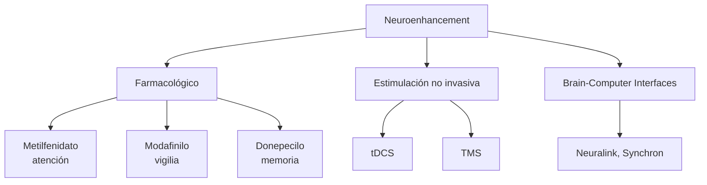

# Neuroética aplicada: libre albedrío, responsabilidad penal y neuroenhancement

> **Tema sin PDF dedicado en el corpus.** Nota explicativa sobre los
> dilemas éticos que abre la neurociencia: experimentos de Libet y libre
> albedrío, fMRI en tribunales, mejoramiento cognitivo, lectura mental,
> privacidad mental. Cross-refs:
> [[04_obhi_haggard_libre_albedrio]] (Libet revisitado),
> [[03_barrett_emocion_y_enfermedad]] (constructos cerebrales y
> psiquiatría), [[01_laureys_estado_vegetativo]] (conciencia y decisiones
> clínicas), [[01_bechtel_mandik_mundale_filosofia_y_neurociencias]]
> (mecanicismo y agencia).

## 1. ¿Qué hace "aplicada" a la neuroética?

Neuroética nombra dos cuerpos distintos:

1. **La ética de la neurociencia**: uso responsable de neurotecnología,
   privacidad de datos neurales, regulación de enhancement.
2. **La neurociencia de la ética**: bases cerebrales del juicio moral,
   altruismo, asco, agencia.

La "aplicada" se centra en (1) con cuatro áreas calientes desde 2000:
**responsabilidad y libre albedrío**, **uso forense de neuroimagen**,
**enhancement cognitivo/emocional**, y **brain reading + privacidad mental**.

## 2. Libet 1983: el experimento y su lectura ingenua

Benjamin Libet (1983, *Brain*) midió en sujetos sanos:

- *RP* (*readiness potential*, Bereitschaftspotential): onda EEG negativa
  sobre la corteza motora suplementaria que precede a un movimiento
  voluntario.
- *W*: el instante en que el sujeto reporta consciencia de la intención
  de moverse, leído desde un reloj de Wundt.
- *M*: el instante del movimiento mismo (EMG).

Resultado canónico:

$$
RP \approx -550\ \text{ms} \quad < \quad W \approx -200\ \text{ms} \quad < \quad M = 0\ \text{ms}
$$

es decir, el cerebro **inicia el preparativo motor ~350 ms antes** de
que el sujeto reporte querer moverse.

Lectura ingenua: "no decidimos, el cerebro decide por nosotros y luego
nos hace creer que decidimos". De aquí saltan los titulares "¡La
neurociencia mata al libre albedrío!"

### 2.1. Críticas técnicas y conceptuales

| Crítica | Detalle |
|---------|---------|
| **RP no es señal de decisión** | Schurger, Sitt & Dehaene (2012): el RP es ruido neural acumulado que cruza un umbral aleatoriamente; no codifica contenido específico. Réplica con modelo acumulador. |
| **W es post-hoc poco confiable** | El timing introspectivo del reloj de Wundt tiene error ±50-100ms; estímulos posteriores pueden retro-modular el reporte (Banks & Isham 2009). |
| **Movimiento arbitrario ≠ decisión moral** | Levantar un dedo "cuando se sienta el impulso" no es decidir hipoteca, votar, casarse. La extrapolación es ilegítima. |
| **Veto consciente preservado** | Libet mismo aceptó que el sujeto puede "vetar" el movimiento entre W y M → libertad como **poder de negar**, no de iniciar (compatibilismo). |
| **Diseño de Soon, Brass, Heinze, Haynes (2008)** | fMRI con MVPA predice elección izquierda/derecha hasta 10s antes del reporte W, **pero con accuracy ~60%**, apenas sobre azar. La predicción es estadística, no determinista. |

### 2.2. Reformulación contemporánea

Hoy hay consenso en que Libet no refuta libre albedrío de modo robusto.
La discusión se desplazó a:

- **Compatibilismo**: libertad = sensibilidad a razones, no
  indeterminismo (Dennett, *Elbow Room*; Frankfurt).
- **Agencia situada**: el "yo" decide *como organismo entero embebido en
  un mundo*, no como homúnculo separado del cerebro (Obhi & Haggard).
- **Determinismo benigno**: incluso si la decisión está causada
  cerebralmente, sigue siendo *mía* si emerge de mis razones, valores,
  historia.

## 3. Responsabilidad penal post-fMRI

### 3.1. Casos paradigmáticos

- **Charles Whitman (1966)**: francotirador en la torre de Texas mata a
  16 personas; autopsia encuentra glioblastoma comprimiendo amígdala.
  Cita en notas pre-suicidio explícitas: "que examinen mi cerebro".
- **Caso del paciente de Burns & Swerdlow (2003)**: hombre de 40 años
  desarrolla pedofilia súbita; tumor orbitofrontal de 6cm. Resección →
  remisión; recurrencia tumoral → recurrencia conductual. Indica
  causalidad biológica directa.
- **Brian Dugan (2009)**: violador y asesino serial; defensa presenta
  fMRI y SPECT mostrando hipoactividad PFC para argumentar atenuante.
  Juez admite la evidencia pero el jurado condena igualmente
  (sentencia de muerte conmutada por moratoria del estado de Illinois).
- **Italia, casos Aldo Bayout (2009) y Stefania Albertani (2011)**:
  primeros usos en Europa de fMRI/genotipado MAOA como atenuantes
  aceptados por tribunal.

### 3.2. Posiciones encontradas

| Posición | Autores | Argumento |
|----------|---------|-----------|
| **Optimismo forense** | Greene & Cohen (2004), *For the law, neuroscience changes nothing and everything*: la neurociencia no refuta el determinismo legal pero erosionará la noción retributiva de castigo a favor de prevención/rehabilitación. |
| **Cautela** | Roskies (2006), Morse (2006): "brain overclaim syndrome" — los jueces sobreinterpretan imágenes; la fMRI a nivel individual tiene poco valor probatorio (sensibilidad/especificidad bajas en muchos contextos). |
| **Escepticismo radical** | Pardo & Patterson (*Minds, Brains and Law*, 2013): el lenguaje legal (intencionalidad, dolo) opera a nivel personal y no es traducible a métricas neurales sub-personales sin error categorial. |
| **Risk assessment computacional** | Aharoni *et al.* (2013): hipoactividad ACC en reos predice reincidencia con AUC ~0.66 — utilidad real pero riesgo discriminatorio (perfilamiento neurobiológico). |

Regla de detección estándar para evidencia fMRI individual (criterio de
admisibilidad propuesto):

$$
P(\text{conducta} \mid \text{patrón neural}) = \frac{P(\text{patrón}\mid \text{conducta})\cdot P(\text{conducta})}{P(\text{patrón})}
$$

Con base rates bajas (e.g. agresión planificada) y especificidad ~80%,
el posterior queda dominado por la prior y la fMRI aporta poco. Esta
es la base del rechazo de "lie detection fMRI" como prueba en USA
(*US v. Semrau*, 2010, 6th Circuit).

## 4. Neuroenhancement: ¿mejorar a sanos?

### 4.1. Evidencia empírica

- **Metilfenidato y modafinilo** en sanos: mejoras modestas y selectivas
  (atención sostenida, vigilia tras privación de sueño). Meta-análisis
  Repantis *et al.* (2010, 2021): efecto pequeño-mediano en tareas
  específicas, no en "inteligencia general". Tradeoffs: ansiedad,
  insomnio, dependencia.
- **Donepecilo en sanos**: ganancia en consolidación de aprendizaje
  declarativo (Yesavage 2002), efecto pequeño, controversial en
  réplicas.
- **tDCS**: estimulación catódica/anódica en PFC durante entrenamiento
  motor o cognitivo; efectos heterogéneos, no robustos en meta-análisis
  recientes (Horvath, Forte & Carter 2015).

### 4.2. Cuatro objeciones éticas clásicas (Sandel 2007, *The Case Against Perfection*)

1. **Naturalidad/dignidad**: alterar el cerebro "como hardware" rompe la
   relación con el carácter dado, base de virtudes como humildad y
   gratitud.
2. **Justicia distributiva**: si el enhancement es caro, profundiza
   desigualdad (ricos acceden, pobres no → meritocracia falseada).
3. **Coerción de fondo**: una vez normalizado (e.g. cirujanos toman
   modafinilo), los demás se ven obligados a tomarlo para competir →
   "carrera armamentista" cognitiva.
4. **Autenticidad**: "¿lo logré yo o lo logró la pastilla?" — debate
   sobre autoría de los logros.

Respuestas: Bostrom & Sandberg (2009), Greely *et al.* (2008,
*Nature*): el enhancement es continuidad de cafeína, educación, lentes
— no requiere nueva categoría ética; regulación de seguridad sí, pero
prohibición no.

## 5. Brain reading, MVPA y privacidad mental

Multi-Voxel Pattern Analysis (Haxby 2001; Kamitani & Tong 2005) y
modelos generativos (Nishimoto *et al.* 2011, reconstrucción de videos
desde fMRI; Tang *et al.* 2023, decoder semántico continuo con LLM)
permiten **inferir contenido mental** desde patrones neurales.

| Capacidad actual | Estado |
|------------------|--------|
| Decodificar categoría de imagen vista | Robust (>80% accuracy) en condiciones controladas |
| Reconstruir percepción visual | Imágenes borrosas pero reconocibles (Takagi & Nishimoto 2023, Stable Diffusion + fMRI) |
| Decodificar habla imaginada | Tang *et al.* 2023, *Nature Neuroscience*: ~70% palabras gist, requiere entrenamiento per-sujeto largo |
| Detectar mentira individual | Pobre fuera de laboratorio; sensible a contramedidas |
| Predecir decisión de compra | Marketing especulativo, claims sobreinflados |

### 5.1. Privacidad mental como nuevo derecho

Yuste *et al.* (2017, *Nature*) y la Iniciativa NeuroRights (Chile 2021,
primera reforma constitucional) proponen **cinco derechos neurales**:

1. Identidad personal (no manipulación).
2. Libre albedrío (decisiones no coercidas neuralmente).
3. Privacidad mental (datos neurales como categoría protegida especial).
4. Acceso equitativo a enhancement.
5. Protección contra sesgos algorítmicos en sistemas neurales.

### 5.2. Posiciones encontradas

| Debate | Pro-derecho específico | Contra-derecho específico |
|--------|------------------------|---------------------------|
| **¿Datos neurales son sui generis?** | Ienca, Andorno (2017): la mente es el último refugio privado; merece categoría legal nueva. | Wachter, Mittelstadt: los marcos GDPR/HIPAA bastan; "neurorights" duplica protecciones. |
| **¿Decoders requieren consentimiento per-uso?** | Sí — el modelo entrenado para tarea A no puede usarse para tarea B sin reconsentir. | Análogo a otros datos médicos; consentimiento amplio basta. |
| **Brain reading penal forzoso?** | Inadmisible (auto-incriminación, 5ta enmienda análoga). | Algunos defienden uso en interrogatorio si hay due process. |

## 6. Dilemas transversales en una tabla

| Dilema | Posición liberal | Posición conservadora | Posición crítica |
|--------|------------------|------------------------|------------------|
| Libet ⇒ no libre albedrío | Compatibilismo: libertad como agencia razonada | Libre albedrío metafísico se mantiene; Libet no aplica | Pregunta mal planteada; libertad no es ausencia de causa |
| fMRI en juicio | Admitir con peritos calificados | Excluir por sobreinterpretación | Riesgo de neuro-discriminación estructural |
| Metilfenidato en sanos | Permitir con info al consumidor | Prohibir por riesgo de coerción | Cuestionar la cultura productivista que lo demanda |
| Brain reading | Regular con consentimiento robusto | Permitir libremente / Prohibir totalmente | Derecho a privacidad mental como nueva categoría |
| Predicción de reincidencia | Útil con auditoría de sesgos | Excluir por dignidad | Refuerza discriminación racial/clase |

## 7. Lectura mínima recomendada

- Libet, B., Gleason, C., Wright, E., Pearl, D. (1983). *Time of
  Conscious Intention to Act in Relation to Onset of Cerebral Activity
  (Readiness-Potential)*. *Brain*, 106, 623-642.
- Schurger, A., Sitt, J. D., Dehaene, S. (2012). *An accumulator model
  for spontaneous neural activity prior to self-initiated movement*.
  *PNAS*, 109(42).
- Greene, J., & Cohen, J. (2004). *For the law, neuroscience changes
  nothing and everything*. *Phil. Trans. R. Soc. B*, 359.
- Roskies, A. (2006). *Neuroscientific Challenges to Free Will and
  Responsibility*. *Trends in Cognitive Sciences*, 10(9).
- Sandel, M. (2007). *The Case Against Perfection*. Harvard UP.
- Greely, H. *et al.* (2008). *Towards responsible use of cognitive-
  enhancing drugs by the healthy*. *Nature*, 456.
- Yuste, R. *et al.* (2017). *Four ethical priorities for
  neurotechnologies and AI*. *Nature*, 551.
- Tang, J., LeBel, A., Jain, S., Huth, A. (2023). *Semantic
  reconstruction of continuous language from non-invasive brain
  recordings*. *Nature Neuroscience*, 26.

---

*Cross-refs internos*: [[04_obhi_haggard_libre_albedrio]] desarrolla
empíricamente la disputa Libet. [[03_barrett_emocion_y_enfermedad]]
muestra cómo los constructos cerebrales reorganizan psiquiatría con
implicaciones éticas. [[01_laureys_estado_vegetativo]] introduce
decisiones clínicas con neuroimagen en pacientes sin reportabilidad.
[[01_bechtel_mandik_mundale_filosofia_y_neurociencias]] proporciona el
marco mecanicista que enmarca todos estos debates.
