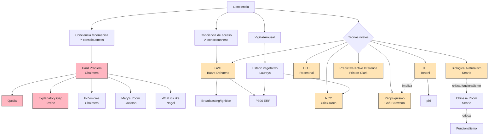
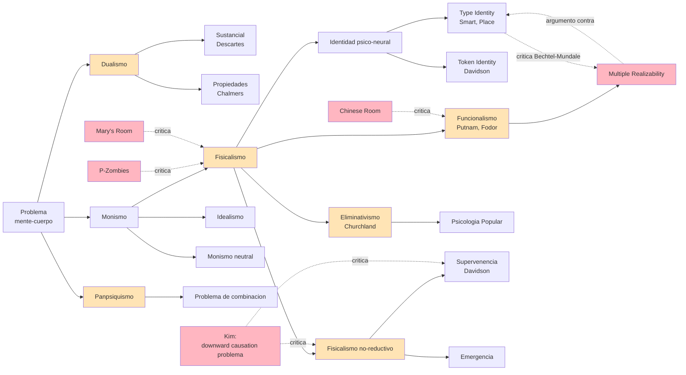
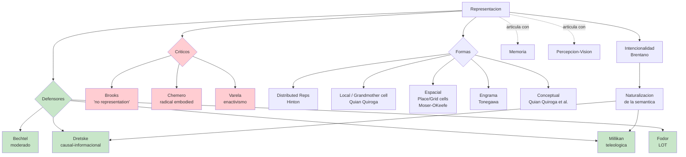
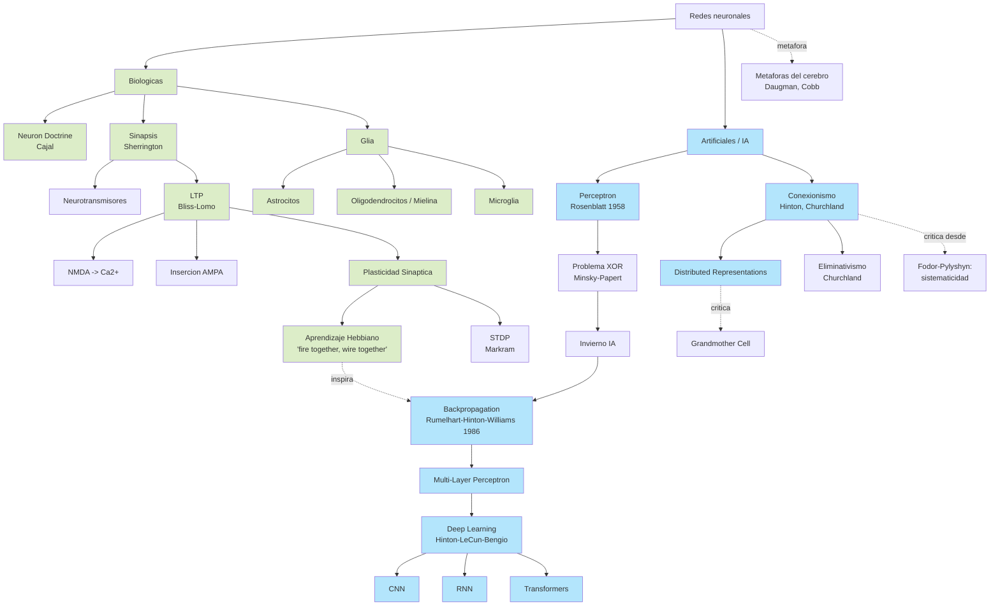
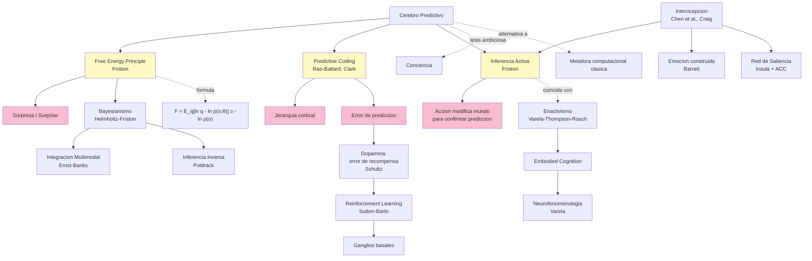
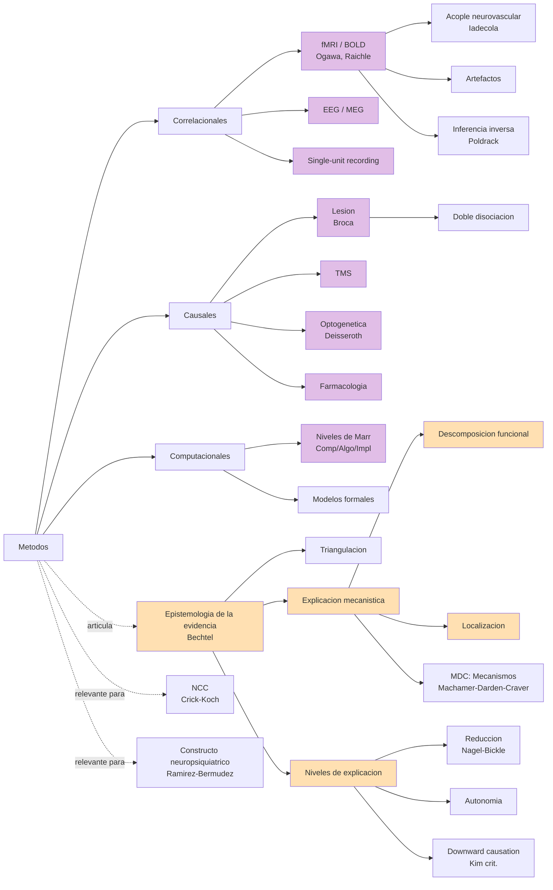

# Mapa conceptual — Filosofia de las Neurociencias

> Mapas Mermaid que sintetizan las relaciones entre las ~95 entradas del
> [glosario completo](./00_glosario_completo.md). Cada mapa cubre un eje
> tematico central del curso.

## 1. Teorias de la conciencia

## 2. Problema mente-cuerpo: posiciones y criticas

## 3. Representacion mental: defensores, escepticos y formas

## 4. Redes neuronales (biologicas e IA) y filosofia

## 5. Cerebro predictivo, free energy y enactivismo

## 6. Metodos, evidencia y explicacion en neurociencia

---

> Estos seis mapas cubren los ejes centrales del curso. Cada nodo apunta
> (implicitamente) a una entrada del glosario principal
> [`00_glosario_completo.md`](./00_glosario_completo.md), donde se
> desarrolla la definicion, el autor, la cita al backup y los cross-refs.
