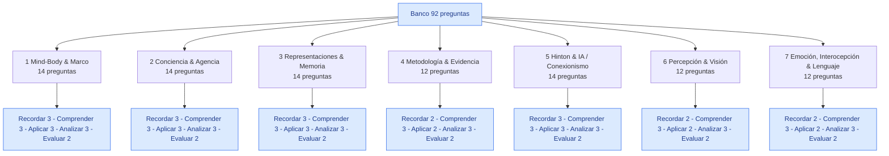

# Banco de preguntas — Filosofía de las Neurociencias 2026-1

> **Profesor:** Steven Vallejo
> **Curso:** Filosofía de las Neurociencias
> **Cohorte:** 2026-1
> **Fecha de armado:** 2026-05-28
> **Total preguntas:** 92

Este banco organiza preguntas tipo parcial **por bloque temático** y por **nivel cognitivo (Bloom)**. Cada pregunta incluye el documento del corpus a consultar (wiki-link al backup) y una pista breve. Pensado para parciales de pregrado en filosofía, psicología o cognitiva.

---

## Convenciones

**Nivel cognitivo (Bloom):**

- 🔴 **Recordar** — hechos, definiciones, autores, fechas, conceptos canónicos.
- 🟠 **Comprender** — explicar con palabras propias, ejemplificar, resumir.
- 🟡 **Aplicar** — usar un concepto en un caso nuevo o calcular/derivar.
- 🟢 **Analizar** — comparar, contrastar, descomponer, identificar supuestos.
- 🔵 **Evaluar** — juzgar, defender, criticar, decidir entre alternativas.

**Bloques temáticos:**

1. Mind-Body & Marco
2. Conciencia & Agencia
3. Representaciones & Memoria
4. Metodología & Evidencia
5. Hinton & IA / Conexionismo
6. Percepción & Visión
7. Emoción, Interocepción & Lenguaje

---

## Mapa de cobertura

**Distribución agregada por nivel:**

| Nivel | Cantidad | % |
|---|---|---|
| 🔴 Recordar | 18 | 19,6 % |
| 🟠 Comprender | 21 | 22,8 % |
| 🟡 Aplicar | 18 | 19,6 % |
| 🟢 Analizar | 21 | 22,8 % |
| 🔵 Evaluar | 14 | 15,2 % |
| **Total** | **92** | **100 %** |

---

## Bloque 1 — Mind-Body & Marco

> Sustancialismo cartesiano, naturalización, reduccionismo / eliminativismo, metáforas, autonomía de la psicología, neurofilosofía.

| # | Pregunta | Nivel | Doc(s) | Pista |
|---|---|:---:|---|---|
| 1.1 | Enumere las características que Descartes atribuye a la *res extensa* y a la *res cogitans*. | 🔴 | [[01_Clases/clase-01-dualismo-a-neurociencia-cognitiva/00_notas]] | Tabla doble: extensión vs. pensamiento. |
| 1.2 | ¿Qué tres campos distinguen Bechtel, Mandik y Mundale al introducir la filosofía de las neurociencias? | 🔴 | [[02_Lecturas/01_fundamentos_y_marco/01_bechtel_mandik_mundale_filosofia_y_neurociencias]] | Neurociencia, ciencia cognitiva, neurociencia cognitiva. |
| 1.3 | ¿En qué carta y a quién plantea la princesa Isabel la objeción al interaccionismo cartesiano? | 🔴 | [[01_Clases/clase-01-dualismo-a-neurociencia-cognitiva/00_notas]] | Correspondencia con Descartes; problema de cómo lo inmaterial mueve lo material. |
| 1.4 | Explique con sus palabras la tesis de la **realizabilidad múltiple** (Putnam) y por qué fundamenta cierta autonomía de la psicología. | 🟠 | [[02_Lecturas/01_fundamentos_y_marco/01_bechtel_mandik_mundale_filosofia_y_neurociencias]] | Un mismo tipo mental, distintos sustratos. |
| 1.5 | Resuma la tesis central de Daugman sobre las metáforas del cerebro y dé dos ejemplos históricos. | 🟠 | [[02_Lecturas/01_fundamentos_y_marco/02_daugman_metaforas_del_cerebro]] | Hidráulica → relojería → telegrafía → computadora. |
| 1.6 | ¿Qué quiere decir que la filosofía de las neurociencias es **naturalista**? Explíquelo en contraste con la filosofía de sillón. | 🟠 | [[02_Lecturas/01_fundamentos_y_marco/01_bechtel_mandik_mundale_filosofia_y_neurociencias]] | La filosofía dialoga con la ciencia, no la juzga desde fuera. |
| 1.7 | Aplique la crítica de Daugman al uso actual de la metáfora de la **red neuronal artificial** como descripción literal del cerebro. | 🟡 | [[02_Lecturas/01_fundamentos_y_marco/02_daugman_metaforas_del_cerebro]] | Cada época usa su tecnología dominante; sospechar de la pretensión de "ya llegamos". |
| 1.8 | Use el problema mente-cuerpo cartesiano para mostrar por qué Patricia Churchland propone naturalizar la psicología popular. | 🟡 | [[02_Lecturas/01_fundamentos_y_marco/05_bickle_churchland_y_neurofilosofias]] | Eliminativismo como sucesor del dualismo. |
| 1.9 | Aplique la noción de "constructo neuropsiquiátrico" al cuadro de un paciente con epilepsia del lóbulo temporal y síntomas psicóticos. | 🟡 | [[02_Lecturas/06_emocion_interocepcion_neuropsiquiatria/04_ramirez_bermudez_constructos_neuropsiquiatricos]] | Patrón psicopatológico + patrón neuropatológico + relación significativa. |
| 1.10 | Compare el **interaccionismo** cartesiano con el **monismo de propiedades** contemporáneo: ¿qué problema metafísico resuelve y cuál hereda? | 🟢 | [[01_Clases/clase-01-dualismo-a-neurociencia-cognitiva/00_notas]], [[01_Clases/clase-05-mente-conducta-cerebro/01_desarrollo_pregunta]] | Resuelve la dualidad de sustancias; sigue debiendo dar cuenta de propiedades fenoménicas. |
| 1.11 | Analice las tres razones que Bickle atribuye a los Churchland para sostener materialismo eliminativo. ¿Cuál le parece más débil? | 🟢 | [[02_Lecturas/01_fundamentos_y_marco/05_bickle_churchland_y_neurofilosofias]] | Estancamiento de la folk-psychology, fallas explicativas, alternativas conexionistas. |
| 1.12 | Distinga "eliminar" de "reducir" en filosofía de la mente. Use un caso del corpus para mostrar por qué la diferencia no es retórica. | 🟢 | [[02_Lecturas/01_fundamentos_y_marco/05_bickle_churchland_y_neurofilosofias]] | Reducir = identificar; eliminar = reemplazar la taxonomía. |
| 1.13 | Evalúe la pregunta de la Quinta Clase: ¿puede una ontología material mínima + formalismo de hipergrafos sustituir vocabulario mentalista sin perder fenómeno? | 🔵 | [[01_Clases/clase-05-mente-conducta-cerebro/01_desarrollo_pregunta]] | Tensar parsimonia explicativa vs. preservación del explanandum. |
| 1.14 | Defienda o critique: "Las metáforas del cerebro son inevitables, por lo tanto irrelevantes filosóficamente". | 🔵 | [[02_Lecturas/01_fundamentos_y_marco/02_daugman_metaforas_del_cerebro]] | Inevitabilidad no implica neutralidad; las metáforas guían programas de investigación. |

---

## Bloque 2 — Conciencia & Agencia

> Vigilia vs. awareness, estado vegetativo y mínimamente consciente, hard problem, Libet, free won't, cerebro predictivo, biomimética (Webb).

| # | Pregunta | Nivel | Doc(s) | Pista |
|---|---|:---:|---|---|
| 2.1 | Defina **vigilia** y **awareness** según Laureys. ¿Pueden disociarse? | 🔴 | [[02_Lecturas/08_conciencia_agencia_y_modelos/01_laureys_estado_vegetativo]] | El estado vegetativo es justo esa disociación. |
| 2.2 | ¿Qué mide el **potencial de preparación** (readiness potential) en el experimento de Libet? | 🔴 | [[02_Lecturas/08_conciencia_agencia_y_modelos/04_obhi_haggard_libre_albedrio]] | Actividad cortical preparatoria previa a la conciencia de la intención. |
| 2.3 | ¿Cuál es la idea central del marco del **cerebro predictivo** según Nave, Deane, Miller y Clark? | 🔴 | [[02_Lecturas/08_conciencia_agencia_y_modelos/02_nave_cerebro_predictivo]] | Generación de predicciones + minimización del error, encarnado y afectivo. |
| 2.4 | Diferencie **easy problem** y **hard problem** de Chalmers; ¿qué impacto tiene la distinción en programas de investigación? | 🟠 | [[01_Clases/clase-05-mente-conducta-cerebro/charla1]], [[01_Clases/clase-05-mente-conducta-cerebro/charla2]] | Funcionales vs. fenoménico; sesga prioridades de financiación y métodos. |
| 2.5 | Explique qué es el **estado mínimamente consciente** y por qué importa clínica y filosóficamente. | 🟠 | [[02_Lecturas/08_conciencia_agencia_y_modelos/01_laureys_estado_vegetativo]] | Señales mínimas pero genuinas; pronóstico y dilemas éticos. |
| 2.6 | Explique la noción de **inferencia activa** (active inference) y cómo se distingue de la pura inferencia perceptiva. | 🟠 | [[02_Lecturas/08_conciencia_agencia_y_modelos/02_nave_cerebro_predictivo]] | El sistema actúa para generar la señal sensorial esperada. |
| 2.7 | Aplique la **paradoja de Libet** a una decisión cotidiana (por ejemplo, levantarse de la silla). ¿Qué queda del libre albedrío? | 🟡 | [[02_Lecturas/08_conciencia_agencia_y_modelos/04_obhi_haggard_libre_albedrio]] | Distinguir iniciación, conciencia, ejecución, veto. |
| 2.8 | Diseñe (en lápiz, una página) un robot grillo análogo al de Webb: ¿qué función aísla y qué decisiones de simplificación toma? | 🟡 | [[02_Lecturas/08_conciencia_agencia_y_modelos/03_webb_grillo_robot]] | Una función concreta (fonotaxis); idealización de las restricciones sensoriales del animal. |
| 2.9 | Aplique la noción de **precision weighting** del cerebro predictivo al caso de un paciente con dolor crónico. | 🟡 | [[02_Lecturas/08_conciencia_agencia_y_modelos/02_nave_cerebro_predictivo]] | Sobreponderación crónica de señales interoceptivas. |
| 2.10 | Compare **IIT** (Tononi) y **GWT** (Dehaene-Baars) como teorías de la conciencia: ¿qué predicen distinto sobre conciencia disociada? | 🟢 | [[02_Lecturas/08_conciencia_agencia_y_modelos/01_laureys_estado_vegetativo]], [[02_Lecturas/09_material_complementario/09_passingham_cognitive_neuroscience]] | IIT = integración intrínseca (φ); GWT = broadcast en workspace global. |
| 2.11 | Analice por qué la **biomimética de Webb** cuenta como explicación mecanística y no como mera simulación matemática. | 🟢 | [[02_Lecturas/08_conciencia_agencia_y_modelos/03_webb_grillo_robot]] | Explicación por construcción del mecanismo; abre y cierra cajas negras físicamente. |
| 2.12 | Analice los supuestos del experimento de Libet que Obhi y Haggard piden refinar (cronometría introspectiva, definición de "intención"). | 🟢 | [[02_Lecturas/08_conciencia_agencia_y_modelos/04_obhi_haggard_libre_albedrio]] | El reloj W es un constructo no transparente. |
| 2.13 | Evalúe el "free won't" como salida al determinismo neural: ¿es una concesión vacía o un giro conceptual genuino? | 🔵 | [[02_Lecturas/08_conciencia_agencia_y_modelos/04_obhi_haggard_libre_albedrio]] | Veto como inhibición consciente; ¿desplaza el problema? |
| 2.14 | Defienda o critique: "el cerebro predictivo disuelve el hard problem porque trata la experiencia como predicción inferencial". | 🔵 | [[02_Lecturas/08_conciencia_agencia_y_modelos/02_nave_cerebro_predictivo]] | ¿Explica el *qué se siente* o sólo lo correlaciona? |

---

## Bloque 3 — Representaciones & Memoria

> Definición funcional-informacional, regulador de Watt, células de la abuela y concept cells, place/grid cells, taxonomías de memoria, engrama, distribuido vs. local vs. sparse.

| # | Pregunta | Nivel | Doc(s) | Pista |
|---|---|:---:|---|---|
| 3.1 | Liste las **tres condiciones** que Bechtel exige para que un estado interno cuente como representación. | 🔴 | [[02_Lecturas/04_memoria_y_representacion/03_bechtel_representaciones]] | Portar información + rol funcional + consumido por el propio mecanismo. |
| 3.2 | ¿Qué descubrieron O'Keefe y los Moser sobre la representación del espacio en el hipocampo y la corteza entorrinal? | 🔴 | [[02_Lecturas/04_memoria_y_representacion/04_moser_moser_gps_del_cerebro]] | Place cells (lugar) y grid cells (métrica hexagonal). |
| 3.3 | Defina **engrama** y nombre dos autores históricos que lo discutieron. | 🔴 | [[02_Lecturas/04_memoria_y_representacion/01_de_brigard_robins_memoria]] | Huella mnéstica; aparece desde la Antigüedad (Aristóteles, Locke...). |
| 3.4 | Explique por qué Bechtel rechaza el **reduccionismo greedy** y qué entiende por **descomposición mecanística**. | 🟠 | [[02_Lecturas/02_metodos_y_evidencia/01_bechtel_epistemologia_de_la_evidencia]], [[02_Lecturas/04_memoria_y_representacion/03_bechtel_representaciones]] | Partes + operaciones + organización; no reducir a química. |
| 3.5 | Explique con el ejemplo del **regulador de Watt** por qué hablar de representación no exige misterios mentales. | 🟠 | [[02_Lecturas/04_memoria_y_representacion/03_bechtel_representaciones]] | Ángulo de los brazos covaría con la velocidad y es consumido por el sistema. |
| 3.6 | Resuma la diferencia entre memoria **episódica**, **semántica** e **implícita**, con un ejemplo cada una. | 🟠 | [[02_Lecturas/04_memoria_y_representacion/01_de_brigard_robins_memoria]] | Mi cumpleaños / París es capital / andar en bici. |
| 3.7 | Aplique la distinción **representación local / distribuida / sparse** al fenómeno de **concept cells** de Quian Quiroga. | 🟡 | [[02_Lecturas/04_memoria_y_representacion/02_quian_quiroga_celulas_de_la_abuela]] | Concept cells: selectividad fuerte pero codificación poblacional. |
| 3.8 | Use el caso de **H.M.** para mostrar la doble disociación entre memoria declarativa e implícita. | 🟡 | [[02_Lecturas/04_memoria_y_representacion/01_de_brigard_robins_memoria]] | Lesión bilateral del hipocampo; podía aprender habilidades sin recordarlas. |
| 3.9 | Reformule la **"buena representación"** de Hinton (económica + reconstructiva) en términos funcional-informacionales de Bechtel. | 🟡 | [[02_Lecturas/01_fundamentos_y_marco/03_hinton_redes_neuronales]], [[02_Lecturas/04_memoria_y_representacion/03_bechtel_representaciones]] | Información + rol funcional + uso interno por el mecanismo. |
| 3.10 | Compare la lectura **anti-representacionalista** (Van Gelder) con la respuesta de Bechtel. ¿Qué pierde y qué gana cada una? | 🟢 | [[02_Lecturas/04_memoria_y_representacion/03_bechtel_representaciones]] | Acoplamiento dinámico vs. estado interno informacional. |
| 3.11 | Analice la tensión **conservación / reconstrucción** en de Brigard y Robins. ¿Cómo afecta a la identidad personal? | 🟢 | [[02_Lecturas/04_memoria_y_representacion/01_de_brigard_robins_memoria]] | Si recordar es reconstruir, el "yo" continuado no es traza literal. |
| 3.12 | Analice por qué decir "hay una neurona para la abuela" es una **caricatura** del hallazgo de Quian Quiroga. | 🟢 | [[02_Lecturas/04_memoria_y_representacion/02_quian_quiroga_celulas_de_la_abuela]] | Selectividad alta ≠ código único; queda código poblacional / sparse. |
| 3.13 | Evalúe: "Las unidades ocultas de una red entrenada **son** representaciones, no meros correlatos funcionales". | 🔵 | [[02_Lecturas/04_memoria_y_representacion/03_bechtel_representaciones]], [[02_Lecturas/01_fundamentos_y_marco/03_hinton_redes_neuronales]] | Aplicar las tres condiciones de Bechtel; preguntar por consumo interno. |
| 3.14 | Defienda o critique: "el hipocampo de los Moser muestra que la memoria episódica es, en el fondo, espacial". | 🔵 | [[02_Lecturas/04_memoria_y_representacion/04_moser_moser_gps_del_cerebro]] | Cognitive map de Tolman; relación espacio-episodio sí, identidad no. |

---

## Bloque 4 — Metodología & Evidencia

> Lesión, registro, fMRI/PET, artefacto, sustracción de condiciones, convergencia de técnicas, mecanismos.

| # | Pregunta | Nivel | Doc(s) | Pista |
|---|---|:---:|---|---|
| 4.1 | Liste los **tres criterios** que Bechtel identifica para apoyar la confiabilidad de una técnica neurocientífica. | 🔴 | [[02_Lecturas/02_metodos_y_evidencia/01_bechtel_epistemologia_de_la_evidencia]] | Repetibilidad, convergencia inter-técnicas, coherencia teórica. |
| 4.2 | ¿Qué señal fisiológica indirecta miden PET y fMRI, y por qué se llama **BOLD**? | 🔴 | [[02_Lecturas/02_metodos_y_evidencia/02_raichle_visualizando_la_mente]] | Blood-Oxygen-Level Dependent; oxigenación = proxy del consumo metabólico. |
| 4.3 | Explique por qué inferir la **función normal** desde el **déficit lesional** es un razonamiento mediado y no transparente. | 🟠 | [[02_Lecturas/02_metodos_y_evidencia/01_bechtel_epistemologia_de_la_evidencia]] | Plasticidad, conexiones colaterales, lesión rara vez es quirúrgica. |
| 4.4 | Explique el método de **sustracción de condiciones** en neuroimagen funcional con un ejemplo experimental. | 🟠 | [[02_Lecturas/02_metodos_y_evidencia/02_raichle_visualizando_la_mente]] | Tarea vs. control activo; restar para aislar la operación. |
| 4.5 | Explique qué es un **artefacto** en neurociencia y dé un ejemplo concreto. | 🟠 | [[02_Lecturas/02_metodos_y_evidencia/01_bechtel_epistemologia_de_la_evidencia]] | Resultado producido por la intervención misma, no por el fenómeno. |
| 4.6 | Aplique los tres criterios de Bechtel a un titular: "fMRI revela el área del amor en el cerebro". | 🟡 | [[02_Lecturas/02_metodos_y_evidencia/01_bechtel_epistemologia_de_la_evidencia]], [[02_Lecturas/09_material_complementario/06_dehaene_seeing_the_mind]] | Repetibilidad, convergencia, coherencia — y separar prensa de paper. |
| 4.7 | Diseñe un experimento mínimo de sustracción para localizar el **procesamiento de caras** y discuta sus límites. | 🟡 | [[02_Lecturas/02_metodos_y_evidencia/02_raichle_visualizando_la_mente]] | Caras vs. casas; el control sesga el resultado (FFA). |
| 4.8 | Analice por qué la **convergencia** de varias técnicas refuerza la inferencia, pero no la garantiza. | 🟢 | [[02_Lecturas/02_metodos_y_evidencia/01_bechtel_epistemologia_de_la_evidencia]] | Las técnicas pueden compartir supuestos no testeados. |
| 4.9 | Analice por qué la **localización funcional** no es lo mismo que la **explicación mecanística** de una función. | 🟢 | [[02_Lecturas/02_metodos_y_evidencia/01_bechtel_epistemologia_de_la_evidencia]] | "El área X se ilumina" ≠ "X hace Y por estas operaciones". |
| 4.10 | Compare evidencia de **lesión**, **registro unicelular** y **neuroimagen**: fortalezas, debilidades y poblaciones a las que aplican. | 🟢 | [[02_Lecturas/02_metodos_y_evidencia/01_bechtel_epistemologia_de_la_evidencia]], [[02_Lecturas/02_metodos_y_evidencia/02_raichle_visualizando_la_mente]] | Lesión: causal pero rara; registro: fino pero invasivo; imagen: no invasiva, indirecta. |
| 4.11 | Evalúe la afirmación de Dehaene: "las imágenes cerebrales son espectaculares — y por eso mismo peligrosas". | 🔵 | [[02_Lecturas/09_material_complementario/06_dehaene_seeing_the_mind]] | Fascinación visual y "neuro-bling"; sobreinterpretación pública. |
| 4.12 | Defienda o critique: "sin un modelo mecanicista previo, fMRI sólo produce **fishing expeditions**". | 🔵 | [[02_Lecturas/02_metodos_y_evidencia/01_bechtel_epistemologia_de_la_evidencia]] | Underdetermination; el dato sin teoría no decide. |

---

## Bloque 5 — Hinton & IA / Conexionismo

> Backprop, hebbiano, PCA, competitivo, sparse, distribuido, los 4 límites de backprop, codes demográficos, Sparks, programa lakatosiano.

| # | Pregunta | Nivel | Doc(s) | Pista |
|---|---|:---:|---|---|
| 5.1 | Liste las **cuatro fases** del algoritmo de retropropagación según Hinton. | 🔴 | [[02_Lecturas/01_fundamentos_y_marco/03_hinton_redes_neuronales]] | Forward, error, gradiente (regla de la cadena), update. |
| 5.2 | Liste los **cuatro límites** que el propio Hinton reconoce de la retropropagación. | 🔴 | [[02_Lecturas/01_fundamentos_y_marco/03_hinton_redes_neuronales]] | Instructor, O(n³), mínimos locales, implausibilidad biológica. |
| 5.3 | Enuncie la **regla de Hebb** en su formulación canónica de 1949. | 🔴 | [[02_Lecturas/01_fundamentos_y_marco/03_hinton_redes_neuronales]] | "Cells that fire together, wire together". |
| 5.4 | Explique en qué sentido las **representaciones distribuidas** de Hinton 1992 desafían el simbolismo clásico (GOFAI). | 🟠 | [[02_Lecturas/01_fundamentos_y_marco/03_hinton_redes_neuronales]] | Sub-simbólico, sin reglas explícitas, emergente del entrenamiento. |
| 5.5 | Explique el **experimento de Sparks** con monos anestesiados y por qué apoya la idea de **códigos poblacionales**. | 🟠 | [[02_Lecturas/01_fundamentos_y_marco/03_hinton_redes_neuronales]] | Silenciar neuronas del colículo no paraliza el ojo — promedia vectores. |
| 5.6 | Explique por qué la retropropagación es **biológicamente implausible** según Hinton. | 🟠 | [[02_Lecturas/01_fundamentos_y_marco/03_hinton_redes_neuronales]] | Requiere simetría de pesos y señal de error global; ningún mecanismo neural conocido la soporta. |
| 5.7 | Aplique la diferencia **local / distribuido / sparse** a un MLP que clasifica dígitos MNIST. | 🟡 | [[02_Lecturas/01_fundamentos_y_marco/03_hinton_redes_neuronales]] | Capa de salida = local (one-hot); ocultas = distribuidas; activaciones reales = sparse. |
| 5.8 | Aplique el **competitive learning (Winner-Takes-All)** a un mapa de Kohonen para imágenes de frutas: ¿qué emerge? | 🟡 | [[02_Lecturas/01_fundamentos_y_marco/03_hinton_redes_neuronales]] | Organización topográfica; vecindarios codifican similitud. |
| 5.9 | Use **PCA hebbiano (Oja 1982)** para mostrar cómo se puede aprender sin instructor externo. | 🟡 | [[02_Lecturas/01_fundamentos_y_marco/03_hinton_redes_neuronales]] | Regla local; extrae componentes principales del input. |
| 5.10 | Compare las trayectorias **conexionista (1992 → LLM 2024)** y **GOFAI (1956 → expert systems)** como programas lakatosianos. | 🟢 | [[02_Lecturas/01_fundamentos_y_marco/03_hinton_redes_neuronales]] | ¿Progresivo (predicciones novedosas) o degenerativo (auxiliares ad hoc)? |
| 5.11 | Analice por qué el éxito funcional de los LLMs **no** garantiza valor neurocientífico explicativo. | 🟢 | [[02_Lecturas/01_fundamentos_y_marco/03_hinton_redes_neuronales]] | Modelo instrumental vs. modelo explicativo; ingeniería ≠ neurociencia. |
| 5.12 | Analice la conexión entre Hinton 1992 y Daugman 1992: ¿qué advierte Daugman sobre el éxito conexionista? | 🟢 | [[02_Lecturas/01_fundamentos_y_marco/03_hinton_redes_neuronales]], [[02_Lecturas/01_fundamentos_y_marco/02_daugman_metaforas_del_cerebro]] | Funcionar ≠ describir; cada época cree haber alcanzado la metáfora final. |
| 5.13 | Evalúe la tesis de Hinton de que **la red neuronal es una apuesta programática, no una descripción del cerebro**. | 🔵 | [[02_Lecturas/01_fundamentos_y_marco/03_hinton_redes_neuronales]] | Distinguir formalismo conexionista de pretensión ontológica. |
| 5.14 | Defienda o critique: "los LLMs contemporáneos (GPT-class) ya no son neurofilosofía; son ingeniería desacoplada del cerebro". | 🔵 | [[02_Lecturas/01_fundamentos_y_marco/03_hinton_redes_neuronales]] | Bio-isomorfismo perdido tras transformers; ¿el programa se volvió degenerativo? |

---

## Bloque 6 — Percepción & Visión

> Vía visual, conos/bastones, retinotopía, especialización funcional (Zeki), color/movimiento, percepción como construcción.

| # | Pregunta | Nivel | Doc(s) | Pista |
|---|---|:---:|---|---|
| 6.1 | Diferencie **conos** y **bastones**: distribución, sensibilidad, función. | 🔴 | [[02_Lecturas/03_percepcion_y_vision/01_trivino_mosquera_vision]] | Conos: fóvea, color, agudeza; bastones: periferia, luz tenue. |
| 6.2 | Trace el recorrido de la información visual desde la retina hasta la corteza V1. | 🔴 | [[02_Lecturas/03_percepcion_y_vision/01_trivino_mosquera_vision]] | Retina → nervio óptico → quiasma → tracto → LGN → radiaciones → V1. |
| 6.3 | Explique con sus palabras la tesis de **especialización funcional** de Zeki. | 🟠 | [[02_Lecturas/03_percepcion_y_vision/02_zeki_imagen_visual_mente_y_cerebro]] | Áreas distintas para color (V4), movimiento (V5/MT), forma. |
| 6.4 | Resuma por qué la visión **no es una copia** del mundo, según Triviño-Mosquera. | 🟠 | [[02_Lecturas/03_percepcion_y_vision/01_trivino_mosquera_vision]] | Espectro limitado, retinotopía deformada, construcción biológica. |
| 6.5 | Explique el fenómeno de **acromatopsia cerebral** y por qué favorece a Zeki contra teorías unificadoras de la visión. | 🟠 | [[02_Lecturas/03_percepcion_y_vision/02_zeki_imagen_visual_mente_y_cerebro]] | Lesión de V4: pérdida del color sin pérdida de forma. |
| 6.6 | Aplique la idea de **percepción como inferencia** a una ilusión de Müller-Lyer u Hollow-mask. | 🟡 | [[02_Lecturas/08_conciencia_agencia_y_modelos/02_nave_cerebro_predictivo]], [[02_Lecturas/03_percepcion_y_vision/02_zeki_imagen_visual_mente_y_cerebro]] | El sistema integra priors y entrega la mejor hipótesis. |
| 6.7 | Use el caso de **akinetopsia** (pérdida selectiva de percepción de movimiento) para argumentar a favor de procesamiento paralelo. | 🟡 | [[02_Lecturas/03_percepcion_y_vision/02_zeki_imagen_visual_mente_y_cerebro]] | Lesión de V5/MT; el mundo se ve como diapositivas. |
| 6.8 | Compare un modelo **jerárquico-serial** (Hubel-Wiesel clásico) con uno **paralelo-distribuido** (Zeki) del córtex visual. | 🟢 | [[02_Lecturas/03_percepcion_y_vision/02_zeki_imagen_visual_mente_y_cerebro]] | Bordes → formas → objetos vs. múltiples vías especializadas en paralelo. |
| 6.9 | Analice cómo la **retinotopía** del córtex visual se conecta con la idea de **representación cartográfica** (Bechtel). | 🟢 | [[02_Lecturas/03_percepcion_y_vision/01_trivino_mosquera_vision]], [[02_Lecturas/04_memoria_y_representacion/03_bechtel_representaciones]] | Mapa = portar información estructural + rol funcional. |
| 6.10 | Analice las consecuencias clínicas de una lesión en el **quiasma óptico** vs. una en el **tracto óptico**. | 🟢 | [[02_Lecturas/03_percepcion_y_vision/01_trivino_mosquera_vision]] | Hemianopsia bitemporal vs. hemianopsia homónima. |
| 6.11 | Evalúe la idea de la **"percepción unitaria"** a la luz de la especialización funcional: ¿es real o ilusión retrospectiva? | 🔵 | [[02_Lecturas/03_percepcion_y_vision/02_zeki_imagen_visual_mente_y_cerebro]] | Binding problem; unidad como integración, no como dato bruto. |
| 6.12 | Defienda o critique: "la visión humana, al ser limitada al espectro visible, es un **fracaso adaptativo**". | 🔵 | [[02_Lecturas/03_percepcion_y_vision/01_trivino_mosquera_vision]] | Adaptación local; criticar el supuesto teleológico. |

---

## Bloque 7 — Emoción, Interocepción & Lenguaje

> Amígdala y miedo (LeDoux), body budget e inflamación (Barrett), constructos neuropsiquiátricos, Broca / Wernicke, lengua de señas, tiempo y espacio del lenguaje.

| # | Pregunta | Nivel | Doc(s) | Pista |
|---|---|:---:|---|---|
| 7.1 | ¿Qué estructura subcortical ocupa el centro de la teoría de LeDoux sobre el **miedo condicionado**? | 🔴 | [[02_Lecturas/06_emocion_interocepcion_neuropsiquiatria/01_ledoux_emocion_memoria_y_cerebro]] | Amígdala (núcleos lateral, basal, central). |
| 7.2 | Liste los **tres hitos históricos** que Baggio identifica en la neurolingüística. | 🔴 | [[02_Lecturas/05_lenguaje/01_baggio_neurolinguistica]] | Broca, Chomsky, técnicas in vivo + análisis computacional. |
| 7.3 | Explique con sus palabras el concepto de **body budget** de Barrett y cómo conecta con inflamación crónica. | 🟠 | [[02_Lecturas/06_emocion_interocepcion_neuropsiquiatria/03_barrett_emocion_y_enfermedad]] | Predicción de recursos (energía, sueño); desequilibrio → inflamación. |
| 7.4 | Explique la tesis principal de Hickok, Bellugi y Klima a partir de pacientes sordos con lesión del hemisferio izquierdo. | 🟠 | [[02_Lecturas/05_lenguaje/02_hickok_bellugi_klima_lenguaje_de_senas]] | La lengua de señas es lenguaje pleno; el cerebro la trata como tal. |
| 7.5 | Resuma las **tres condiciones** que Ramírez-Bermúdez et al. exigen para un constructo neuropsiquiátrico. | 🟠 | [[02_Lecturas/06_emocion_interocepcion_neuropsiquiatria/04_ramirez_bermudez_constructos_neuropsiquiatricos]] | Patrón psicopatológico + patrón neuropatológico + relación significativa. |
| 7.6 | Aplique la idea de **emoción como construcción** (Barrett) al diagnóstico de un cuadro depresivo. | 🟡 | [[02_Lecturas/06_emocion_interocepcion_neuropsiquiatria/03_barrett_emocion_y_enfermedad]] | Categorías clínicas separadas comparten ingredientes biológicos. |
| 7.7 | Use el **modelo del miedo de LeDoux** para explicar por qué algunas fobias persisten a pesar de saber que son irracionales. | 🟡 | [[02_Lecturas/06_emocion_interocepcion_neuropsiquiatria/01_ledoux_emocion_memoria_y_cerebro]] | Vía rápida tálamo-amígdala; aprendizaje emocional poco accesible a la conciencia reflexiva. |
| 7.8 | Compare las afasias clásicas de **Broca** y de **Wernicke**: localización, déficit, lecciones para la modularidad. | 🟢 | [[02_Lecturas/05_lenguaje/01_baggio_neurolinguistica]] | Producción vs. comprensión; lobulo frontal inferior vs. temporal posterior. |
| 7.9 | Analice por qué la existencia de las **lenguas de señas** debilita una teoría del lenguaje centrada en lo **auditivo-vocal**. | 🟢 | [[02_Lecturas/05_lenguaje/02_hickok_bellugi_klima_lenguaje_de_senas]] | El canal no define al lenguaje; sí lo hace la organización formal. |
| 7.10 | Analice la relación entre **interocepción** y **diagnóstico psiquiátrico** según Barrett y Ramírez-Bermúdez. | 🟢 | [[02_Lecturas/06_emocion_interocepcion_neuropsiquiatria/03_barrett_emocion_y_enfermedad]], [[02_Lecturas/06_emocion_interocepcion_neuropsiquiatria/04_ramirez_bermudez_constructos_neuropsiquiatricos]] | Cuerpo como base de afecto; biomarcadores tentativos. |
| 7.11 | Evalúe: "la separación entre enfermedad mental y física es **ontológicamente** indefendible". | 🔵 | [[02_Lecturas/06_emocion_interocepcion_neuropsiquiatria/03_barrett_emocion_y_enfermedad]] | Construccionismo vs. esencialismo de los DSM-like. |
| 7.12 | Defienda o critique: "la neurolingüística debe subordinarse a la lingüística teórica para no convertirse en cartografía vacía". | 🔵 | [[02_Lecturas/05_lenguaje/01_baggio_neurolinguistica]] | Mapear sin saber qué se mapea = error categorial. |

---

## Resumen final por bloque

| Bloque | Total | 🔴 | 🟠 | 🟡 | 🟢 | 🔵 |
|---|---|---|---|---|---|---|
| 1. Mind-Body & Marco | 14 | 3 | 3 | 3 | 3 | 2 |
| 2. Conciencia & Agencia | 14 | 3 | 3 | 3 | 3 | 2 |
| 3. Representaciones & Memoria | 14 | 3 | 3 | 3 | 3 | 2 |
| 4. Metodología & Evidencia | 12 | 2 | 3 | 2 | 3 | 2 |
| 5. Hinton & IA / Conexionismo | 14 | 3 | 3 | 3 | 3 | 2 |
| 6. Percepción & Visión | 12 | 2 | 3 | 2 | 3 | 2 |
| 7. Emoción, Interocepción & Lenguaje | 12 | 2 | 3 | 2 | 3 | 2 |
| **Total** | **92** | **18** | **21** | **18** | **21** | **14** |

---

> **Versionado:** v1.0 — 28 mayo 2026. Construido a partir del corpus en `/home/dev/backup-neuro/repo/Contenidos/Explicaciones/Temas/` y `/Curso/`.
> **Próxima iteración sugerida:** añadir versiones cortas (multiple-choice) para autoevaluación rápida y mapear cada pregunta a los outcomes del syllabus.

---

## Apendice — Guia de preguntas de estudio (28 preguntas con referencias de lectura)

> Preguntas tipo parcial con indicacion de texto a consultar. No estan respondidas a proposito.
> Fuente: `_organizacion_2026-05-28/04_PREGUNTAS_GUIA_PARCIAL.md`

## Bloque A · Marco y fundamentos

### 1. ¿Por qué la filosofía y la neurociencia no convergieron automáticamente durante el siglo XX?
- Texto: Bechtel, Mandik & Mundale (1).
- Repasar: argumentos de Putnam (multiple realizability) y Fodor (autonomía taxonómica).

### 2. ¿Qué entiende Bechtel-Mandik-Mundale por "filosofía naturalista de la neurociencia"? Contrastarlo con un enfoque puramente *a priori*.
- Texto: 1.
- Notar la asimetría: la filosofía se deja informar por la ciencia, pero la ciencia también se beneficia del análisis conceptual.

### 3. Daugman sostiene que las teorías del cerebro están históricamente apuntaladas en metáforas tecnológicas. Identificá tres metáforas históricas y discutí: ¿la metáfora es decorativa o constitutiva?
- Texto: Daugman (2a), [[02_daugman_metaforas_del_cerebro]].

### 4. ¿Qué es la representación distribuida en conexionismo? ¿Qué problema clásico del simbolismo resuelve y cuál no?
- Texto: Hinton (2b), [[03_hinton_redes_neuronales]].

### 5. Eliminativismo de los Churchland: distinguí la versión fuerte (sustitución total) de la versión sobria (revisión). ¿Cuál es más defendible y por qué?
- Texto: Bickle (3b), [[05_bickle_churchland_y_neurofilosofias]] + [[02_dos_posturas_de_los_profesores]].

### 6. Reconstruí en tus propias palabras la "tercera postura" señalada en las notas de quinta clase (monismo material + modelos estructurales relacionales). ¿En qué se diferencia de eliminativismo y de emergentismo?
- Texto: [[02_dos_posturas_de_los_profesores]].

## Bloque B · Método y evidencia

### 7. ¿Qué significa decir que la evidencia neurocientífica está "mediada por instrumentos"? Da un ejemplo concreto donde la elección de técnica condicione la conclusión.
- Texto: Bechtel (4a), [[01_bechtel_epistemologia_de_la_evidencia]], [[02_instrumentos_intervencion_y_artefactos]].

### 8. ¿Qué mide exactamente la señal BOLD? Enumerar dos artefactos comunes y un supuesto fisiológico que su uso presupone.
- Texto: Raichle (4b), [[02_raichle_visualizando_la_mente]].

### 9. Lesiones y déficits: ¿qué inferencias autoriza el método lesional y cuáles no? Explicá por qué la doble disociación es preferida a la simple disociación.
- Texto: [[03_lesiones_y_deficits]].

### 10. Comparar el alcance explicativo de neuroimagen funcional, EEG y registros unicelulares en términos de resolución espacial y temporal. ¿Qué pregunta es óptima para cada técnica?
- Texto: Raichle (4b), Ray (3a).

### 11. Localización vs. mecanismo: ¿qué problema explicativo persiste después de mapear correlatos neurales de una función?
- Texto: [[06_localizacion_mecanismos_y_limites]] + Bechtel (4a, 13a).

## Bloque C · Conceptos puente

### 12. Defendé y critique la noción funcional de representación de Bechtel. ¿Cómo respondería un enactivista (Varela, Hutto)?
- Texto: Bechtel (13a), [[03_bechtel_representaciones]].

### 13. ¿Qué significa "cerebro predictivo"? Reconstruí el esquema básico de inferencia bayesiana en percepción y explicá qué se entiende por *error de predicción*.
- Texto: Nave et al. (15a), [[02_nave_cerebro_predictivo]].

### 14. Interocepción y self: ¿por qué los teóricos contemporáneos consideran que la conciencia tiene base corporal? Reconstruí la línea Damasio → Chen → Barrett.
- Texto: Chen et al. (11a), Barrett (11b), [[02_chen_interocepcion]], [[03_barrett_emocion_y_enfermedad]].

### 15. Constructos neuropsiquiátricos: ¿en qué sentido funcionan como "puente" entre psicopatología y neuropatología según Ramírez-Bermúdez et al.? Da un ejemplo concreto.
- Texto: Ramírez-Bermúdez et al. (5a), [[04_ramirez_bermudez_constructos_neuropsiquiatricos]].

## Bloque D · Estudios de caso

### 16. Vía dorsal y vía ventral: explica la doble disociación entre acción visual y reconocimiento. Cita un caso clínico canónico (DF, RV o equivalente).
- Texto: Triviño-Mosquera (6a), Zeki (6b), [[01_trivino_mosquera_vision]].

### 17. ¿Qué problema metateórico abre la especialización funcional radical de Zeki (V4 color, V5 movimiento)? ¿Cómo se conecta con el *binding problem*?
- Texto: Zeki (6b), [[02_zeki_imagen_visual_mente_y_cerebro]].

### 18. Memoria como reconstrucción (de Brigard & Robins): ¿qué implicaciones tiene esta tesis para el testimonio forense y para la noción de identidad personal?
- Texto: De Brigard & Robins, [[01_de_brigard_robins_memoria]].

### 19. Hipótesis de células de la abuela: contrastá la evidencia de Quian Quiroga con la codificación distribuida del conexionismo. ¿Son incompatibles?
- Texto: Quian Quiroga, [[02_quian_quiroga_celulas_de_la_abuela]] + Hinton (2b).

### 20. Sistema GPS del cerebro (células de lugar y red): ¿qué tipo de representación interna sugiere y por qué es relevante filosóficamente?
- Texto: Moser & Moser (13b), [[04_moser_moser_gps_del_cerebro]].

### 21. Lenguaje de señas y plasticidad lingüística: ¿qué implica el caso para el debate modularidad vs. plasticidad funcional?
- Texto: Hickok et al. (8b), [[02_hickok_bellugi_klima_lenguaje_de_senas]].

### 22. Modelo clásico de la emoción (LeDoux, vía corta amigdalar) versus constructivismo emocional (Barrett): ¿en qué punto teórico difieren y qué evidencia decide entre ellos?
- Texto: LeDoux (9b), Barrett (11b).

### 23. Lóbulos frontales y funciones ejecutivas: reconstruí qué se pierde en pacientes con lesión orbitofrontal (caso EVR/Elliot). ¿Apoya la hipótesis del marcador somático de Damasio?
- Texto: Suchy (12a), Miller & Cummings (12b), [[01_suchy_funciones_ejecutivas]].

### 24. Estados vegetativos y conciencia mínima: ¿qué inferencias permiten paradigmas activos en fMRI (Owen, Laureys) sobre presencia de conciencia? ¿Qué supone esto sobre el correlato neural mínimo?
- Texto: Laureys (10b), [[01_laureys_estado_vegetativo]].

## Bloque E · Conciencia, agencia, integración

### 25. Reconstruí los experimentos de Libet y la noción de "free won't" (Obhi-Haggard). Discutí al menos dos objeciones metodológicas (Schurger, Mele).
- Texto: Obhi & Haggard (16b), [[04_obhi_haggard_libre_albedrio]].

### 26. Hard Problem (Chalmers) vs. easy problems: ¿es la distinción coherente o un artefacto conceptual (Dennett)? Defendé una posición con argumentos.
- Texto: discusión general; complementar con resúmenes en [[03_RESUMENES_POR_AUTOR]] (Chalmers, Dennett, Block).

### 27. Modelado artificial como estrategia explicativa (Webb, robot grillo): ¿qué aporta y qué no aporta un modelo robótico a la comprensión del cerebro biológico?
- Texto: Webb (15b), discusión de Bloque 5.

### 28. Tomá las dos posturas de los profesores (analítica-revisionista vs. emergentista-sistémica) y defendé tu propia posición en el debate, citando al menos tres autores del curso.
- Texto: [[02_dos_posturas_de_los_profesores]] + libre.

## Pauta de evaluación sugerida (para autocorrección)

Por respuesta, chequeá:

- [ ] ¿Identificaste autor y tesis principal?
- [ ] ¿Diste al menos un argumento del autor?
- [ ] ¿Diste al menos una objeción/limitación?
- [ ] ¿Tomaste posición propia (donde corresponde)?
- [ ] ¿Citaste al menos un texto del curso?
- [ ] ¿Evitaste antropomorfismo, reificación de categorías y "explicar con etiquetas"?

## Sub-banco para autoexamen rápido (10 preguntas relámpago)

Para repasar en 30 minutos a 3 min/pregunta:

1. Tres metáforas históricas del cerebro (Daugman).
2. Diferencia A-consciousness vs. P-consciousness (Block).
3. Qué cuantifica $\Phi$ en IIT.
4. Por qué el RP de Libet no implica determinismo (Schurger).
5. Tres regiones del default mode network (Raichle).
6. Doble disociación: definición y por qué importa.
7. Tres argumentos contra realizabilidad múltiple (Bickle / Churchland).
8. Qué predice predictive coding sobre alucinaciones (Friston).
9. Tres marcadores somáticos en el caso EVR (Damasio).
10. Vía dorsal vs. ventral: regiones y función.

---

Ver: [[00_Inicio/02_mapa_del_curso]] · [[01_GLOSARIO_CONCEPTOS]] · [[02_PLAN_DE_ESTUDIO]] · [[03_RESUMENES_POR_AUTOR]].
