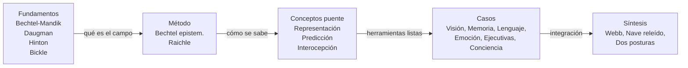

# Plan de estudio — Filosofía de las Neurociencias

> Secuencia recomendada en 5 bloques con tiempo estimado y justificación pedagógica.
> Total estimado: ~38-45 horas de lectura activa + ~8 h de repaso = unas 3 semanas a ~2 h/día.

## Lógica general del orden

La pregunta filosófica sobre el cerebro es **interdisciplinar y mediada por instrumentos**. Por eso conviene:

1. Establecer primero **qué es el campo** y por qué no se reduce a una ciencia particular.
2. Aprender **cómo se produce evidencia** antes de discutir qué dice la evidencia.
3. Adquirir **conceptos puente** (representación, predicción, interocepción, mecanismo) que aparecerán en todos los casos.
4. Recorrer los **estudios de caso** ya pertrechados.
5. Cerrar con un **bloque integrador** (predicción + libre albedrío + modelado) que permite relectura crítica de todo lo anterior.

Evitar el error frecuente: empezar por conciencia y Hard Problem antes de tener el marco metodológico. Eso suele producir discusiones metafísicas sin tracción empírica.

## Bloque 1 — Fundamentos y marco (~6 h)

| Lectura | Tiempo | Por qué primero |
|---------|--------|-----------------|
| Bechtel, Mandik & Mundale (texto 1) | 1.5 h | Define el campo, presenta Putnam/Fodor; sin esto el resto flota. |
| Daugman (2a) | 1 h | Permite leer el resto desensibilizado a la metáfora computacional. |
| Hinton (2b) | 1.5 h | Conexionismo concreto; ayuda a entender la alternativa al simbolismo. |
| Bickle (3b) | 1.5 h | Posiciona el espectro reduccionismo↔autonomía; introduce a los Churchland. |
| Ray (3a) | 0.5 h (consulta) | Repaso anatómico para tener vocabulario; no leer entero. |

**Objetivo al cerrar el bloque**: saber distinguir psicología popular, ciencia cognitiva, neurociencia y neurociencia cognitiva, y nombrar tres argumentos por los cuales su relación no es trivial.

## Bloque 2 — Método y evidencia (~5 h)

| Lectura | Tiempo | Aporte |
|---------|--------|--------|
| Bechtel (4a) | 2 h | Cómo se construye evidencia; mediación instrumental. |
| Raichle (4b) | 1.5 h | Caso paradigmático: fMRI y default mode. |
| Notas CuartaClase 01-06 | 1.5 h | Lesiones, instrumentos, localización vs. mecanismos. |

**Por qué después de Bloque 1**: ya tenés el campo definido; ahora cuestionás cómo sabe lo que sabe.

**Pregunta de control**: ¿qué inferencias autoriza un mapa BOLD? ¿Qué no autoriza?

## Bloque 3 — Conceptos puente (~6 h)

| Lectura | Tiempo | Aporte |
|---------|--------|--------|
| Bechtel — Representations (13a) | 1.5 h | Qué cuenta como representación. |
| Nave et al. — Predictive brain (15a) | 1.5 h | Predicción como esquema unificador. |
| Chen et al. — Interocepción (11a) | 1.5 h | Cuerpo en el lazo. |
| Ramírez-Bermúdez et al. (5a) | 1.5 h | Puente psicopatología-neuropatología. |

**Por qué aquí**: estos cuatro conceptos (representación, predicción, interocepción, constructos puente) reaparecen en cada caso; tenerlos *antes* permite leer los casos con red.

## Bloque 4 — Estudios de caso (~16 h)

Recorrer en este orden, con ~2 h por caso. Si tenés que recortar, elegí 3 casos en lugar de 6.

| Sub-bloque | Lectura(s) | Tiempo | Razón del orden |
|------------|------------|--------|-----------------|
| 4a · Visión | Triviño-Mosquera (6a) + Zeki (6b) | 2.5 h | El caso más limpio; vías especializadas, doble disociación. |
| 4b · Memoria | De Brigard & Robins (7a) + Quian Quiroga (7b) + Moser-Moser (13b) | 4 h | Memoria como reconstrucción; selectividad neuronal; mapas cognitivos. |
| 4c · Lenguaje | Baggio (8a) + Hickok et al. (8b) | 2.5 h | Lenguaje de señas como prueba contra reduccionismo lengua=oído. |
| 4d · Emoción | LeDoux (9b) + Barrett (11b) | 2.5 h | Modelo clásico (amígdala) vs. constructivismo emocional. |
| 4e · Funciones ejecutivas | Suchy (12a) + Miller-Cummings (12b) | 2.5 h | Lóbulos frontales como caso de doble vínculo neurología/sujeto. |
| 4f · Conciencia y agencia | Laureys (10b) + Obhi-Haggard (16b) | 2 h | Conciencia clínica y experimentos de Libet. |

**Estrategia de lectura en cada caso**: (1) abstract + conclusiones; (2) figura/diagrama central; (3) lectura completa; (4) volvé al glosario para anclar conceptos.

## Bloque 5 — Síntesis e integración (~5 h)

| Lectura | Tiempo | Función |
|---------|--------|---------|
| Webb — Cricket Robot (15b) | 1.5 h | Modelado artificial como estrategia explicativa. |
| Relectura de Nave (15a) | 1 h | Ahora con los casos en la mano. |
| Notas QuintaClase: *dos posturas de los profesores* | 1 h | Mapeás analítica/eliminativista vs. emergentista/sistémica. |
| Notas QuintaClase: *Charla1*, *Charla2*, *lecturas* | 1.5 h | Discusión integradora del curso. |

**Objetivo de cierre**: poder defender una posición propia en el espectro reduccionismo↔autonomía con evidencia de al menos 3 casos.

## Curva pedagógica — síntesis

## Sesiones de repaso (~8 h)

- Sesión 1 (2 h): glosario completo + autotest sin mirar — ver [[01_GLOSARIO_CONCEPTOS]].
- Sesión 2 (2 h): contestá 10 preguntas al azar de [[04_PREGUNTAS_GUIA_PARCIAL]].
- Sesión 3 (2 h): redactá 1 mini-ensayo (1500 palabras) sobre tu posición en el debate reduccionismo↔autonomía.
- Sesión 4 (2 h): repaso de [[03_RESUMENES_POR_AUTOR]] verificando que podés citar la posición + 1 objeción de cada autor.

## Recortes pragmáticos según tiempo disponible

- **1 semana**: solo Bloques 1-2-3 + 2 casos a elección. Glosario ítems esenciales.
- **2 semanas**: agregá los 6 casos completos y bloque 5.
- **3 semanas (plan completo)**: todo + repasos.

## Trampa común

No empezar por el Hard Problem ni por el debate IIT-vs-GWT. Esos son legibles solo después del Bloque 2; sin método/evidencia debajo, terminás en ping-pong de intuiciones.

---

Ver: [[00_MAPA_DEL_CURSO]] · [[01_GLOSARIO_CONCEPTOS]] · [[03_RESUMENES_POR_AUTOR]] · [[04_PREGUNTAS_GUIA_PARCIAL]].
