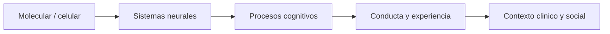
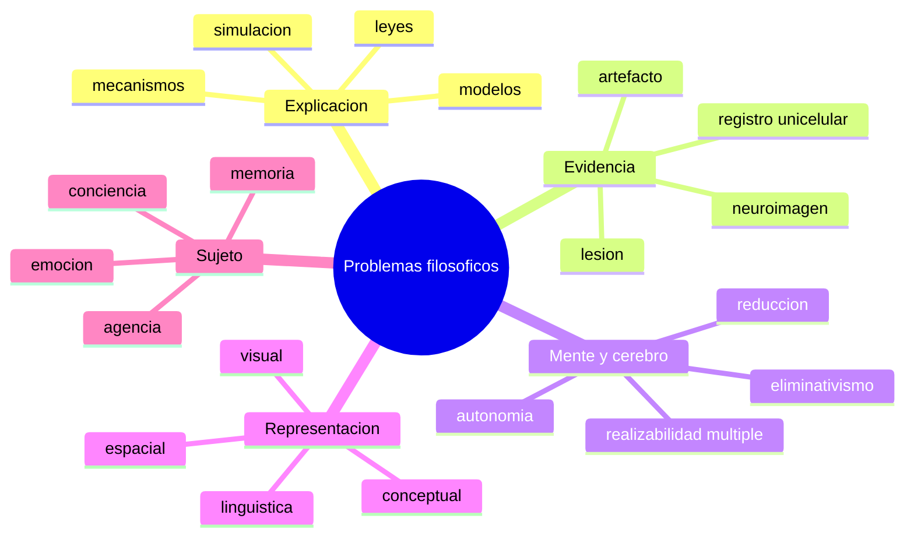

# Mapa general del campo

## 1. Arquitectura general de la materia

```mermaid
flowchart TD
    A[Filosofia de las neurociencias] --> B[Fundamentos filosoficos]
    A --> C[Metodos y evidencia]
    A --> D[Percepcion y vision]
    A --> E[Memoria y representacion]
    A --> F[Lenguaje]
    A --> G[Emocion e interocepcion]
    A --> H[Funciones ejecutivas y frontales]
    A --> I[Conciencia y agencia]
    A --> J[Modelos y critica historica]

    B --> B1[Bechtel, Mandik y Mundale]
    B --> B2[Daugman]
    B --> B3[Bickle]
    B --> B4[Hinton]

    C --> C1[Bechtel]
    C --> C2[Raichle]
    C --> C3[Mental Mechanisms]

    D --> D1[Trivino-Mosquera et al.]
    D --> D2[Zeki]

    E --> E1[de Brigard y Robins]
    E --> E2[Quian Quiroga et al.]
    E --> E3[Bechtel - representaciones]
    E --> E4[Moser y Moser]

    F --> F1[Baggio]
    F --> F2[Hickok, Bellugi y Klima]

    G --> G1[LeDoux]
    G --> G2[Chen et al.]
    G --> G3[Barrett]
    G --> G4[Ramirez-Bermudez et al.]

    H --> H1[Suchy]
    H --> H2[Miller y Cummings]

    I --> I1[Laureys]
    I --> I2[Obhi y Haggard]
    I --> I3[Nave et al.]

    J --> J1[Webb]
    J --> J2[Chirimuuta]
    J --> J3[Cobb]
```



## 2. Niveles de analisis



## 3. Donde aparecen los grandes problemas filosoficos



## 4. Esquema logico minimo del campo

```latex
\[
\text{Filosofía de las neurociencias}

=
\text{análisis de conceptos}
\;+\;
\text{análisis de métodos}
\;+\;
\text{análisis de explicaciones}
\;+\;
\text{uso filosófico de resultados neurocientíficos}
\]
```

