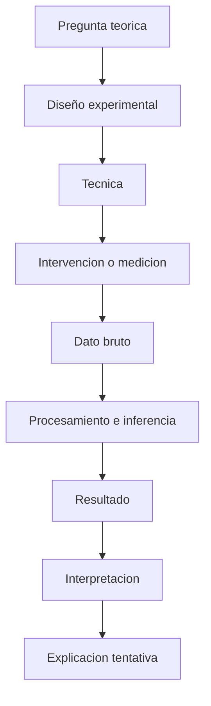
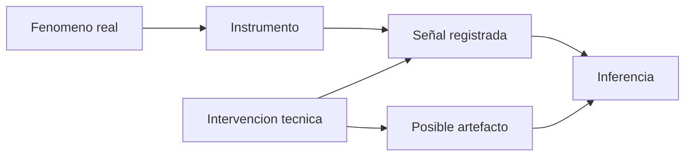
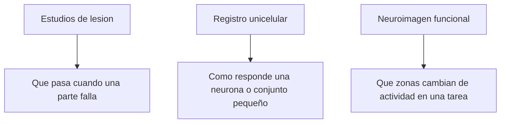

# Metodos, evidencia y explicacion

## 1. Como se produce evidencia en neurociencia cognitiva



## 2. Riesgo de artefacto



## 3. Tres grandes tecnicas del bloque



## 4. Esquema mecanicista de Bechtel

```latex
\[
\text{Fenómeno}
\Longrightarrow
\text{descomposición en partes}
\Longrightarrow
\text{identificación de operaciones}
\Longrightarrow
\text{organización temporal y espacial}
\Longrightarrow
\text{reconstrucción del mecanismo}
\]
```

## 5. Forma abstracta de una explicacion por mecanismo

```latex
\[
M = \langle P, O, R \rangle
\]
```

donde:

- \(P\) = partes del sistema;
- \(O\) = operaciones que realizan;
- \(R\) = relaciones u organizacion entre partes y operaciones.

Entonces:

```latex
\[
M \;\vdash\; \Phi
\]
```

se lee como: el mecanismo \(M\) explica el fenomeno \(\Phi\).

## 6. Criterios de validacion de evidencia en Bechtel

```latex
\[
\text{Confiabilidad de una técnica}
\approx
f(R, C, T)
\]
```

donde:

- \(R\) = repetibilidad del resultado;
- \(C\) = convergencia con otras tecnicas;
- \(T\) = coherencia con teorias plausibles.

No es una formula del texto, sino una formalizacion util de su idea central.

