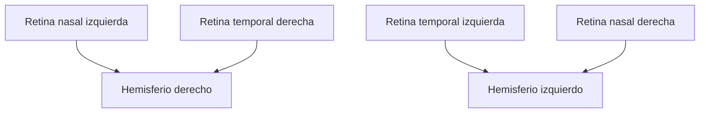
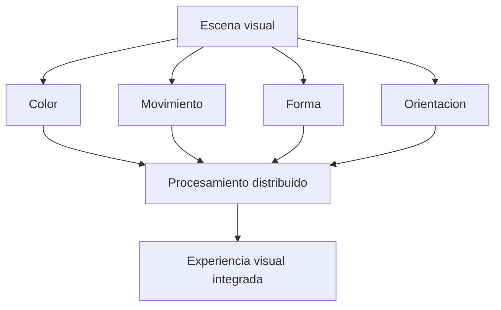
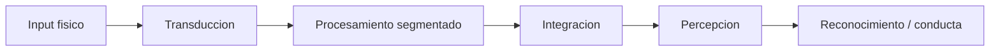

# Vision y representacion visual

## 1. Via visual basica


## 2. Cruce de informacion en el quiasma



## 3. Especializacion funcional al estilo Zeki



## 4. Esquema computacional minimo de percepcion visual

```latex
\[
I(x,y,\lambda,t)
\]
```

puede leerse como una señal luminica dependiente de:

- posicion espacial \((x,y)\),
- longitud de onda \(\lambda\),
- tiempo \(t\).

Una formalizacion minima del procesamiento visual seria:

```latex
\[
V = \mathcal{T}(I)
\]
```

donde \(I\) es la entrada luminica y \(\mathcal{T}\) representa la cadena de transformaciones neurales que terminan en experiencia y discriminacion visual.

## 5. Lo filosofico del sistema visual



Lectura filosofica:

- no hay copia directa del mundo;
- hay transformacion y seleccion;
- la unidad fenomenica resulta de procesos distribuidos.

