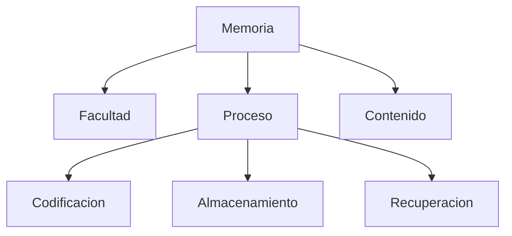
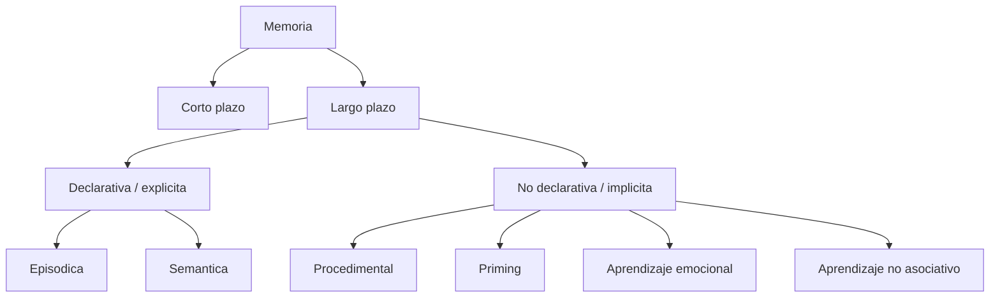
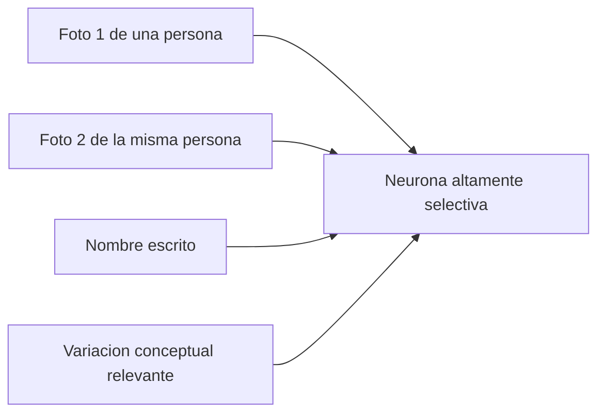
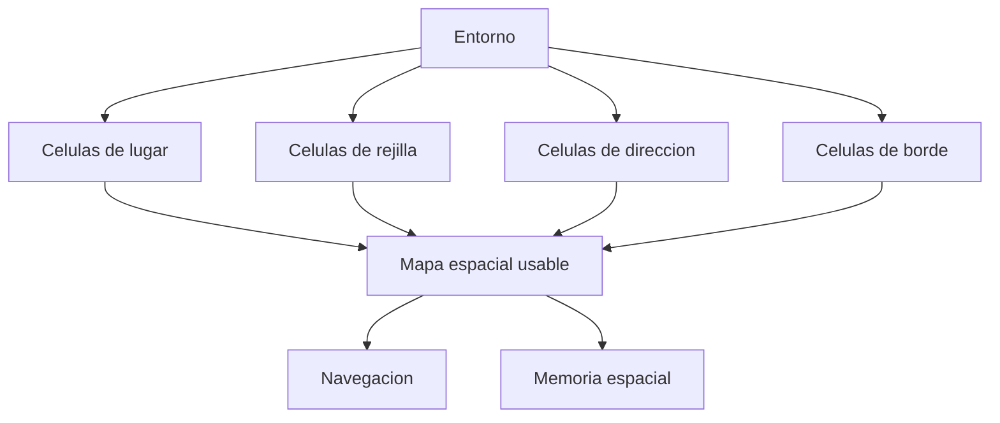

# Memoria, representacion y espacio

## 1. Memoria segun de Brigard y Robins



## 2. Modelo estandar de memoria



## 3. Problema filosofico de la huella

```latex
\[
E_0 \xrightarrow{\text{codificación}} T \xrightarrow{\text{conservación}} R_t
\]
```

donde:

- \(E_0\) = evento inicial;
- \(T\) = traza o engrama;
- \(R_t\) = recuerdo recuperado en un tiempo posterior.

La pregunta filosofica es:

```latex
\[
R_t = E_0 \; ?
\]
```

o mejor:

```latex
\[
R_t \approx f(E_0, T, C_t)
\]
```

donde \(C_t\) representa el contexto de recuperacion. Esto permite una lectura reconstructiva de la memoria.

## 4. Celulas concepto



Punto clave:

- no responde solo a una imagen particular;
- responde a un referente o concepto mas abstracto.

## 5. Mapa espacial



