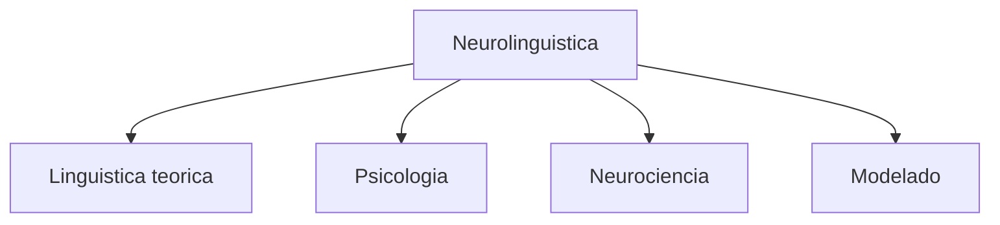
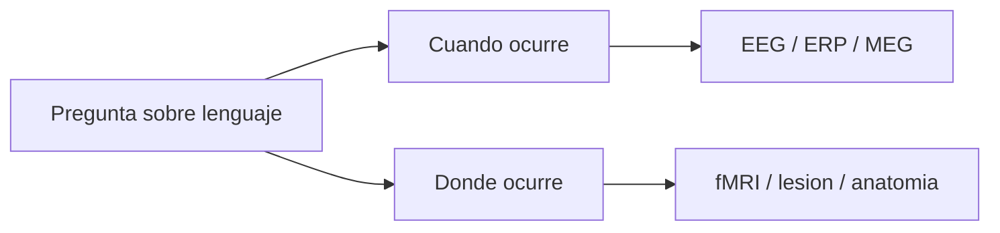
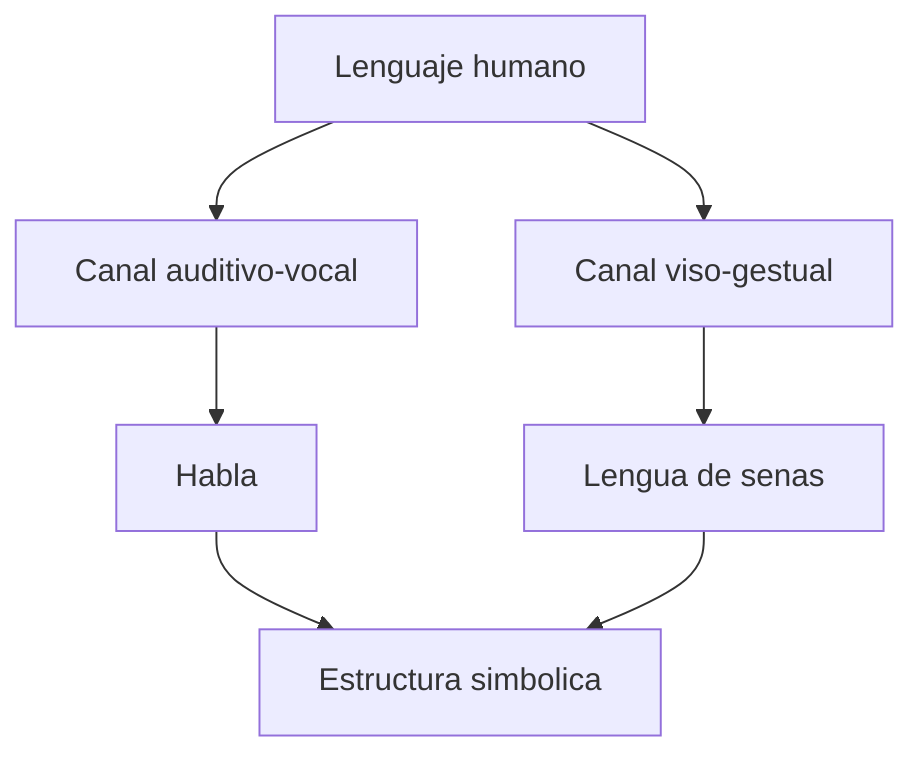

# Lenguaje y arquitecturas

## 1. Neurolinguistica como campo



## 2. Lenguaje en tiempo y espacio



## 3. Caso del lenguaje de senas



## 4. Formalizacion minima del problema

```latex
\[
L = \langle Ph, G, S \rangle
\]
```

donde:

- \(Ph\) = estructura fonologica o forma de señal;
- \(G\) = estructura gramatical;
- \(S\) = estructura semantica.

La neurolinguistica pregunta por una realizacion neural:

```latex
\[
\mathcal{N}(L)
\]
```

es decir, como se implementa neuralmente un sistema linguistico.

