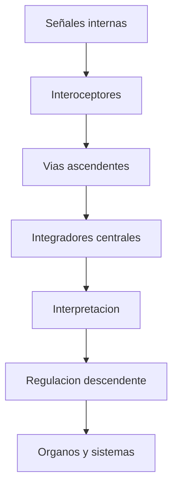
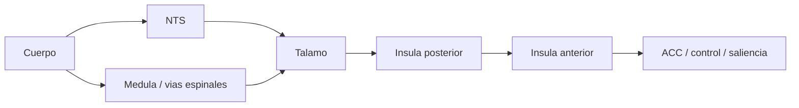
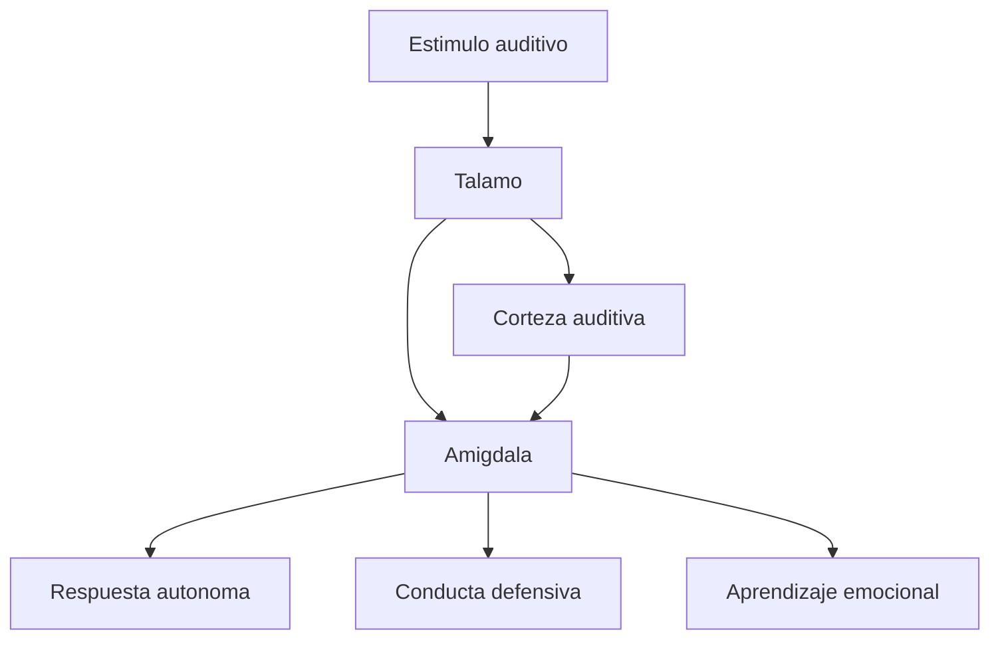
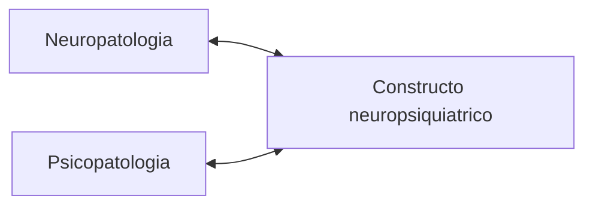

# Interocepcion, emocion y neuropsiquiatria

## 1. Marco general de la interocepcion



## 2. Nodos principales



## 3. LeDoux y el miedo



## 4. Barrett y el presupuesto corporal

```latex
\[
B_t = R_t - D_t
\]
```

donde:

- \(B_t\) = estado del presupuesto corporal en un tiempo \(t\),
- \(R_t\) = recursos disponibles,
- \(D_t\) = demandas anticipadas o reales.

Si el cerebro sobreestima repetidamente \(D_t\), entonces:

```latex
\[
B_t < 0
\]
```

y aumenta el riesgo de desregulacion e inflamacion cronica.

## 5. Neuropsiquiatria como puente



Lectura:

- no hay identidad simple entre dano cerebral y cuadro clinico;
- tampoco hay separacion absoluta;
- el constructo puente organiza la relacion.

