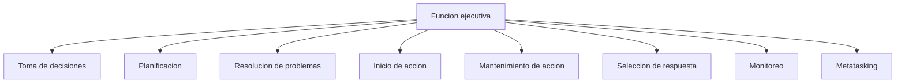
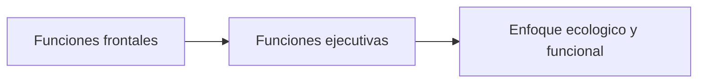
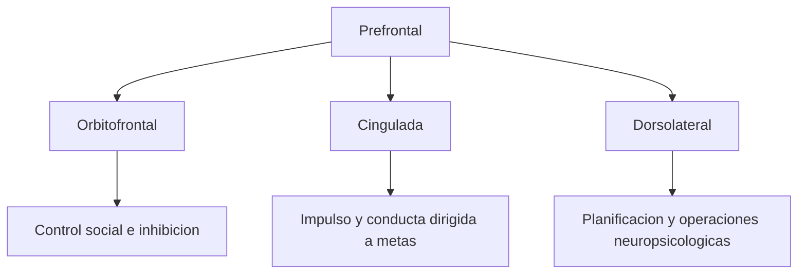

# Funciones ejecutivas, frontales y agencia

## 1. Estructura del dominio ejecutivo



## 2. Historia conceptual



## 3. Triparticion clasica de prefrontal



## 4. Agencia minima como esquema funcional

```latex
\[
\text{Agencia} = f(G, P, S, M)
\]
```

donde:

- \(G\) = generacion de metas,
- \(P\) = planificacion,
- \(S\) = seleccion de respuesta,
- \(M\) = monitoreo.

Si alguno falla gravemente, la agencia se desorganiza.

