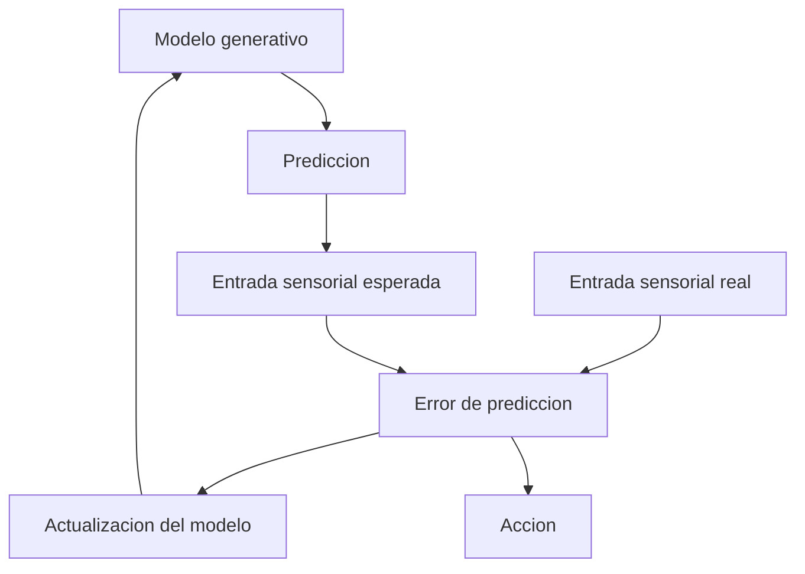
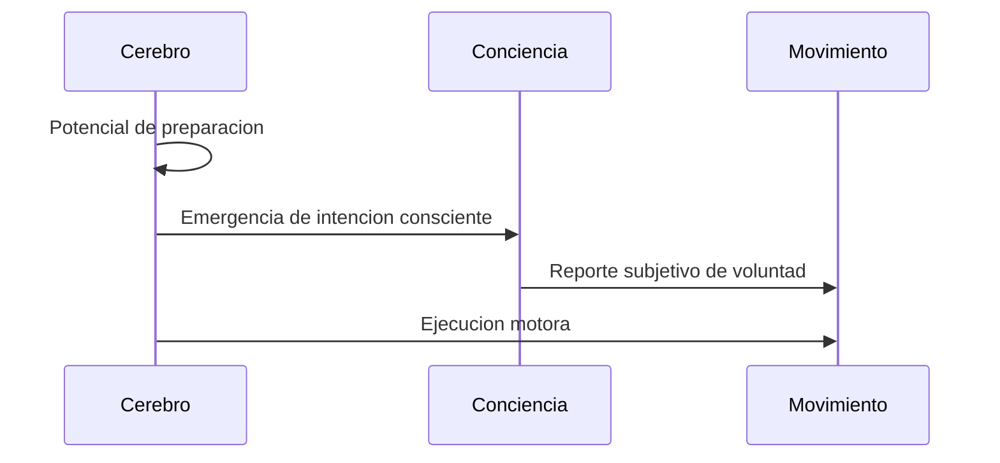
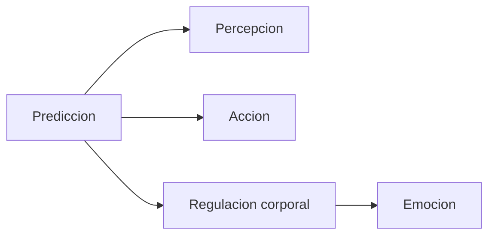

# Cerebro predictivo y formalizacion

## 1. Esquema minimo del procesamiento predictivo



## 2. Forma matematica minima

```latex
\[
\varepsilon = s - \hat{s}
\]
```

donde:

- \(s\) = señal sensorial real,
- \(\hat{s}\) = señal sensorial predicha,
- \(\varepsilon\) = error de prediccion.

El sistema intenta minimizar:

```latex
\[
\min \; \varepsilon^2
\]
```

o, en versiones mas generales:

```latex
\[
\min \; F
\]
```

donde \(F\) puede leerse como una cantidad tipo energia libre variacional.

## 3. Precision

```latex
\[
\varepsilon_w = \Pi \, \varepsilon
\]
```

donde \(\Pi\) representa el peso de precision asignado al error. Esto sirve para entender por que algunos errores "cuentan" mas que otros.

## 4. Inferencia activa

```latex
\[
a^{*} = \arg\min_{a} \; \varepsilon(s(a), \hat{s})
\]
```

Lectura:

la accion \(a\) puede seleccionarse para que la señal sensorial resultante se acerque a la prediccion util del sistema.

## 5. Obhi y Haggard como linea temporal minima



## 6. Lectura filosofica



Punto fuerte del modelo:

- no separa de manera tajante percepcion, accion y cuerpo;
- permite conectar cognicion, interocepcion y ambiente.

