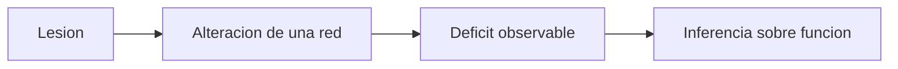

# Lesiones y deficits

## Que se busca con el metodo de lesion

En los estudios de lesion se observa que funcion cambia o desaparece cuando cierta parte del cerebro resulta danada.

La idea general es:

- si una lesion altera una capacidad;
- entonces esa zona probablemente participa en esa capacidad.

## Por que no es tan simple

La clase de hoy ayuda a no leer esto de manera ingenua.

Una lesion no permite concluir sin mas que:

- una zona aislada `contiene` una funcion completa;
- el deficit observado refleja exactamente una sola operacion;
- la funcion normal se reconstruye facilmente a partir del dano.

## Problemas tipicos

- una lesion puede afectar varias redes a la vez;
- el deficit visible puede ser indirecto;
- el cerebro puede reorganizarse;
- dos personas con lesiones parecidas pueden mostrar efectos distintos.

## Esquema util

La inferencia no es directa. Siempre hay pasos intermedios.

## Idea para recordar

Las lesiones fueron historicamente muy importantes, pero no dan una fotografia transparente de la arquitectura mental.

## Para estudiar

Pregunta tipica: que muestra una lesion.

Respuesta corta:

- muestra que cierta region o red era relevante para una capacidad;
- no demuestra por si sola toda la estructura del proceso mental implicado.
