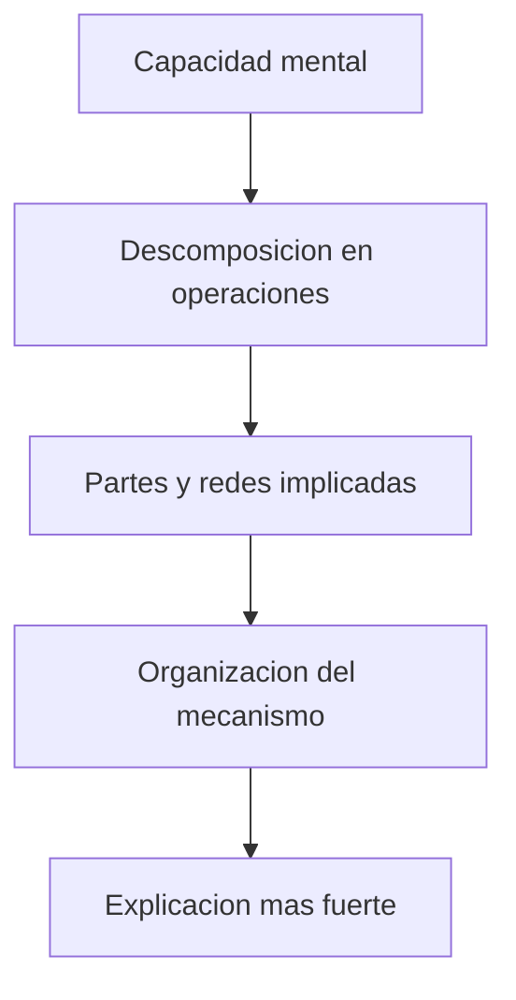

# Localizacion, mecanismos y limites

## Una confusion comun

Muchas veces se cree que explicar una capacidad mental es encontrar `donde ocurre`.

La cuarta clase matiza mucho esa idea.

## Localizar no basta

Saber que una zona participa en una tarea es importante, pero explicar exige mas:

- que operaciones ocurren;
- como se conectan entre si;
- que partes del sistema participan;
- como se organiza el mecanismo completo.

## Idea de mecanismo

Explicar un mecanismo es descomponer una capacidad en:

- partes;
- operaciones;
- organizacion.

## Esquema rapido

## Tesis importante para estudiar

- localizacion sin mecanismo es insuficiente;
- mecanismo sin buena evidencia tambien es debil;
- una buena explicacion combina evidencia, descomposicion funcional y organizacion neural.

## Para estudiar

Pregunta tipica: que diferencia hay entre localizar y explicar.

Respuesta corta:

- localizar es ubicar una participacion neural;
- explicar es mostrar como partes organizadas producen una capacidad.
