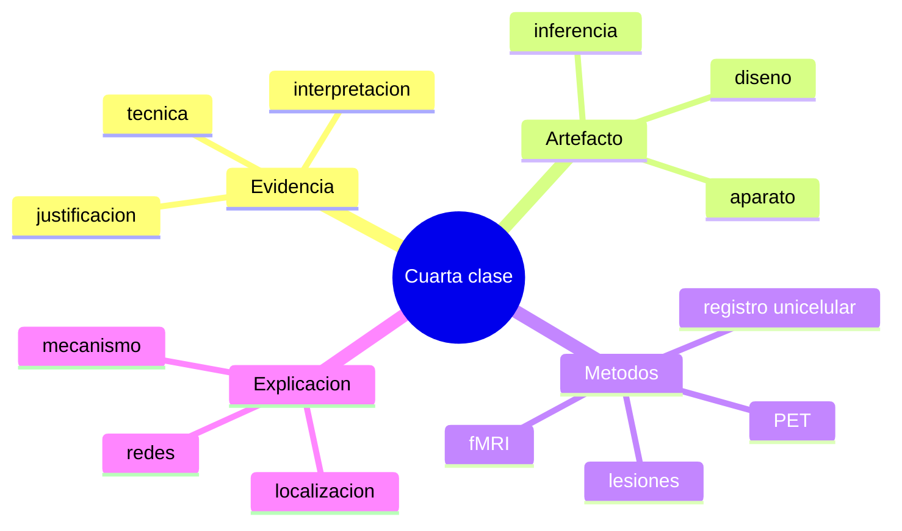

# Glosario basico

## Terminos clave de la cuarta clase

- `Evidencia`: dato que cuenta a favor de una hipotesis porque fue producido e interpretado de manera justificada.
- `Epistemologia de la evidencia`: analisis de como se valida que un resultado experimental cuenta realmente como evidencia.
- `Artefacto`: resultado producido por la tecnica o el procedimiento y no por el fenomeno estudiado.
- `Lesion`: dano en una parte del sistema nervioso que altera funciones o conductas.
- `Deficit`: perdida o alteracion observable de una capacidad.
- `Registro unicelular`: tecnica para medir actividad de neuronas individuales.
- `PET`: tecnica de imagen funcional basada en trazadores y metabolismo.
- `fMRI`: tecnica de imagen funcional basada en cambios hemodinamicos asociados a actividad neural.
- `Sustraccion`: comparacion entre condicion experimental y condicion de control.
- `Localizacion`: asociacion entre una capacidad y una region o red cerebral.
- `Mecanismo`: conjunto organizado de partes y operaciones que produce una capacidad.
- `Convergencia`: acuerdo parcial entre distintas tecnicas o lineas de evidencia.

## Correcciones de escritura utiles

- `epistemologia` es correcto
- `evidencia` es correcto
- `artefacto` es correcto
- `lesion` es correcto
- `deficit` es correcto
- `convergencia` es correcto
