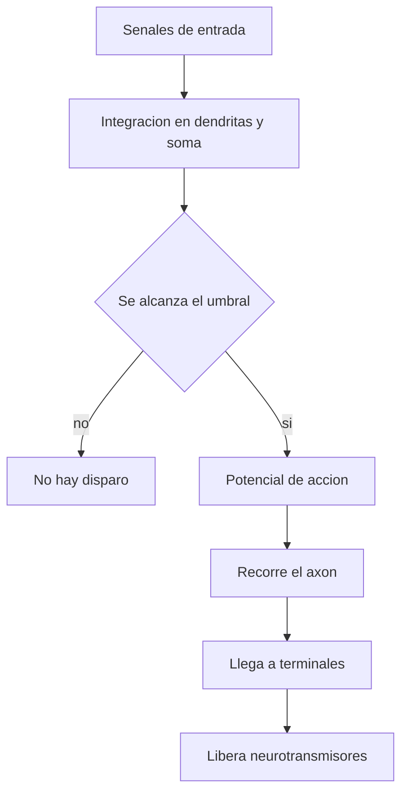

# Neuronas

## Que son

Las neuronas son las celulas especializadas en recibir, transformar y transmitir informacion en el sistema nervioso.

No trabajan aisladas. Cada neurona forma parte de una red enorme y su funcion depende de las conexiones que tiene con otras celulas.

## Partes principales

- `Dendritas`: reciben senales de otras neuronas.
- `Soma` o cuerpo celular: integra la informacion y mantiene viva la celula.
- `Axon`: conduce la senal hacia otras celulas.
- `Terminales sinapticas`: liberan neurotransmisores.

## Como funciona una neurona

Una neurona recibe senales por sus dendritas. Si la suma de esas senales alcanza cierto umbral, genera un `potencial de accion`, que es una descarga electrica breve que recorre el axon.

Cuando esa descarga llega al final del axon, la neurona libera sustancias quimicas llamadas `neurotransmisores`. Esas sustancias pasan a la siguiente celula a traves de la sinapsis.

## Esquema funcional

## Relacion simple

De forma muy resumida:

\[
\text{Salida neuronal} \approx
\begin{cases}
1, & \text{si la entrada total supera el umbral} \\
0, & \text{si no lo supera}
\end{cases}
\]

No significa que una neurona real sea tan simple, pero sirve para estudiar la idea de `umbral`.

## Ideas importantes

- La neurona no solo "enciende" o "apaga": integra muchas entradas al mismo tiempo.
- La forma de sus conexiones importa tanto como la neurona misma.
- El cerebro funciona por redes de neuronas, no por una sola neurona aislada.

## Para estudiar

Pregunta tipica: que diferencia hay entre dendrita y axon.

Respuesta corta:

- la dendrita suele recibir informacion
- el axon suele enviar informacion
