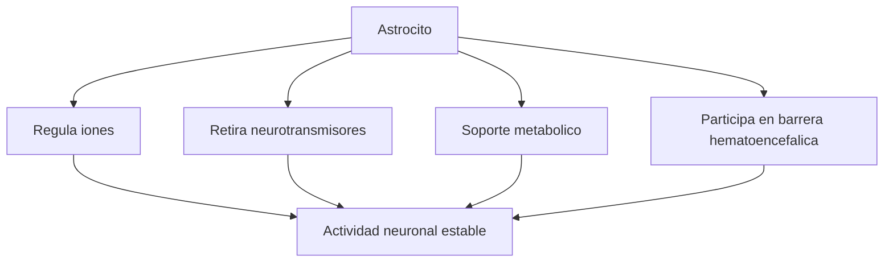
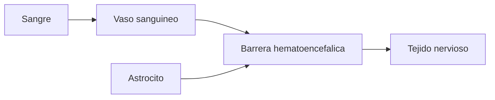

# Astrocitos

## Que son

Los astrocitos son celulas gliales. No transmiten informacion como las neuronas, pero hacen posible que las neuronas funcionen bien.

## Funciones principales

- Mantienen estable el ambiente quimico alrededor de las neuronas.
- Regulan concentraciones de iones como el potasio.
- Ayudan a retirar exceso de neurotransmisores de la sinapsis.
- Dan soporte metabolico: aportan energia y nutrientes.
- Participan en la `barrera hematoencefalica`.

## Por que importan

Si el entorno quimico cambia demasiado, la neurona deja de funcionar bien. Por eso los astrocitos no son un detalle secundario: ayudan a que la actividad cerebral sea estable y segura.

## Barrera hematoencefalica

La barrera hematoencefalica es un sistema de control entre la sangre y el tejido nervioso. No deja pasar libremente cualquier sustancia al cerebro.

Los astrocitos colaboran con vasos sanguineos y otras celulas para regular ese intercambio.

## Idea clave

La neurona parece la protagonista, pero sin astrocitos no podria mantener un medio adecuado para trabajar.
