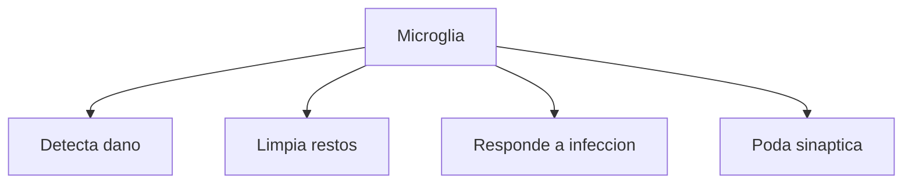
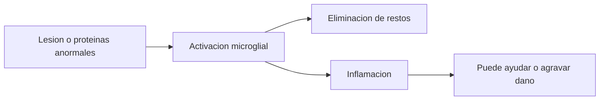

# Microglia

## Que es

La microglia es la principal celula de defensa inmunologica del sistema nervioso central.

## Funciones principales

- Detecta dano o infeccion.
- Elimina restos celulares y agentes nocivos.
- Participa en procesos de inflamacion.
- Colabora en la `poda sinaptica`, es decir, en la eliminacion de conexiones que sobran o se usan poco.

## Por que importa en clase

Muchas veces se piensa el cerebro solo como una red electrica. La microglia muestra que el cerebro tambien tiene vigilancia, limpieza y respuestas inmunologicas propias.

## Relacion con enfermedad

En enfermedades neurodegenerativas, como Alzheimer, la microglia aparece ligada a procesos de inflamacion y manejo de proteinas anormales. No siempre protege de forma suficiente y a veces su activacion sostenida puede contribuir al dano.

## Idea clave

La microglia no es una neurona ni una celula de soporte pasivo. Es parte activa del mantenimiento y defensa del tejido nervioso.
