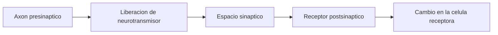
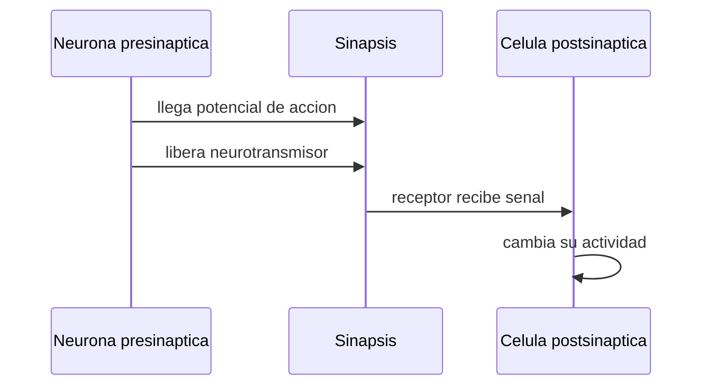

# Sinapsis y neurotransmisores

## Que es una sinapsis

La sinapsis es el punto de comunicacion entre una neurona y otra celula.

En la mayoria de los casos, una neurona libera neurotransmisores y esos neurotransmisores modifican la actividad de la celula que recibe la senal.

## Pasos basicos

1. Llega el potencial de accion al final del axon.
2. Se liberan neurotransmisores.
3. Los neurotransmisores cruzan el espacio sinaptico.
4. Se unen a receptores en la celula siguiente.
5. La celula receptora cambia su actividad.

## Secuencia visual

## Neurotransmisores

Los neurotransmisores son mensajeros quimicos.

Ejemplos frecuentes:

- `Glutamato`: suele ser excitador.
- `GABA`: suele ser inhibidor.
- `Dopamina`: modulacion, aprendizaje, movimiento y recompensa.
- `Serotonina`: modulacion de estado de animo, sueno y otras funciones.
- `Acetilcolina`: memoria, atencion y control muscular en otros contextos.

## Excitacion e inhibicion

- Una senal `excitadora` aumenta la probabilidad de que la neurona dispare.
- Una senal `inhibidora` la reduce.

El cerebro funciona por equilibrio entre ambas.

## Relacion simple

Una forma minima de pensarlo es:

\[
\text{entrada neta} = \text{excitacion} - \text{inhibicion}
\]

Si la entrada neta supera cierto umbral, aumenta la probabilidad de disparo.

## Idea clave

La informacion neuronal no pasa solo por electricidad. Tambien pasa por quimica.
