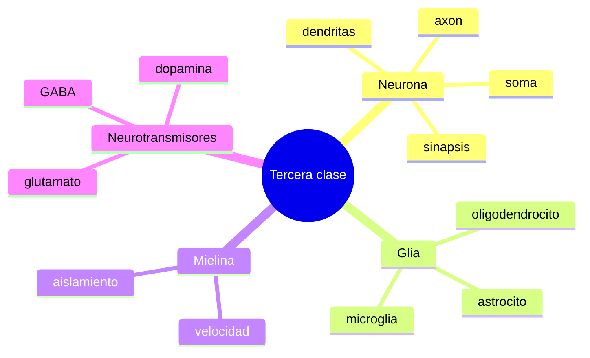

# Glosario basico

## Terminos clave de la tercera clase

- `Neurona`: celula que recibe y transmite informacion.
- `Glia`: conjunto de celulas no neuronales que sostienen, protegen y regulan la actividad nerviosa.
- `Astrocito`: glia que regula el ambiente quimico y apoya metabolicamente a las neuronas.
- `Microglia`: glia inmunologica del cerebro.
- `Oligodendrocito`: glia que produce mielina en el sistema nervioso central.
- `Mielina`: capa aislante que acelera la conduccion del impulso.
- `Axon`: prolongacion de la neurona que conduce la senal.
- `Dendrita`: prolongacion que suele recibir senales.
- `Soma`: cuerpo celular de la neurona.
- `Sinapsis`: zona de comunicacion entre celulas.
- `Neurotransmisor`: sustancia quimica que transmite senales en la sinapsis.
- `Barrera hematoencefalica`: sistema que regula el paso de sustancias desde la sangre al tejido cerebral.
- `Poda sinaptica`: eliminacion selectiva de conexiones sinapticas.
- `Sistema nervioso central`: cerebro y medula espinal.

## Correcciones de escritura utiles

- `mielina` es correcto
- `oligodendrocito` es correcto
- `microglia` es correcto
- `astrocito` es correcto
- `hematoencefalica` es correcto
