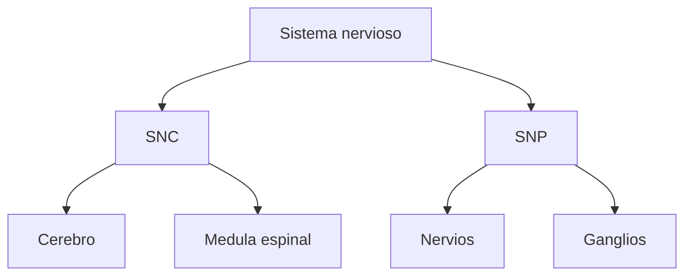

# Sistema nervioso central y periferico

## Idea basica

Una division inicial muy importante es esta:

- `Sistema nervioso central` o `SNC`: cerebro y medula espinal.
- `Sistema nervioso periferico` o `SNP`: nervios y ganglios fuera del SNC.

## Que hace cada uno

El `SNC` concentra gran parte del procesamiento, la integracion y la coordinacion.

El `SNP` conecta el SNC con el resto del cuerpo. Lleva informacion sensorial hacia el centro y ordenes motoras hacia musculos y organos.

## Por que importa

Cuando el profesor divide el sistema nervioso en central y periferico, lo hace para que entiendas que no todo ocurre dentro del cerebro.

El cerebro depende de conexiones constantes con el cuerpo.

## Idea clave

El `SNC` organiza e integra. El `SNP` conecta y distribuye.
