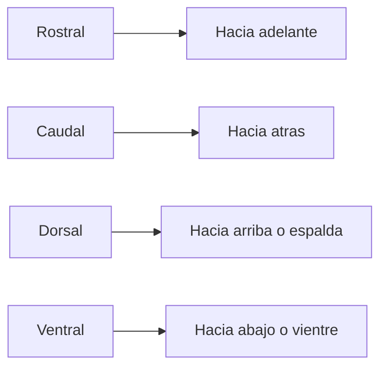

# Orientacion neuroanatomica

## Para que sirve

En neuroanatomia no basta con decir "arriba" o "abajo". Se usan terminos tecnicos para ubicar partes del sistema nervioso.

## Terminos importantes

- `Rostral`: hacia adelante, hacia la region frontal o la "nariz".
- `Caudal`: hacia atras o hacia la cola.
- `Dorsal`: hacia la espalda o la parte superior.
- `Ventral`: hacia adelante del cuerpo o la parte inferior, segun la region.

## Dificultad en humanos

En humanos estos terminos se vuelven un poco mas complicados porque el eje del sistema nervioso no es totalmente recto. El encefalo y la medula no siguen una linea perfecta.

Por eso, en el cerebro y en la medula, `dorsal` y `ventral` no siempre coinciden con las mismas direcciones espaciales simples.

## En que ayuda

Estos terminos sirven para leer imagenes, esquemas, cortes anatomicos y descripciones clinicas.

## Idea clave

Si no entiendes `rostral`, `caudal`, `dorsal` y `ventral`, despues se vuelve muy dificil seguir explicaciones sobre corteza, tronco encefalico o medula.
