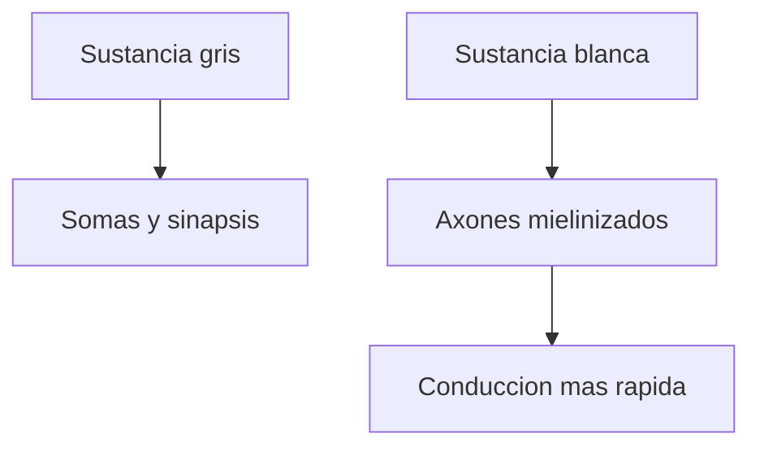

# Sustancia gris y sustancia blanca

## Sustancia gris

La `sustancia gris` contiene sobre todo cuerpos neuronales, dendritas y muchas sinapsis.

Es una zona muy asociada al procesamiento e integracion de informacion.

## Sustancia blanca

La `sustancia blanca` contiene sobre todo axones, muchos de ellos recubiertos por mielina.

Su aspecto mas claro se relaciona con esa mielina.

## Relacion con mielina

La mielina ayuda a que la informacion viaje mas rapido por los axones.

Por eso la sustancia blanca suele pensarse como una red de conexiones entre regiones.

## No significa

No hay que pensar:

- gris = importante
- blanca = secundaria

Las dos son esenciales. Una ayuda a procesar y la otra a conectar.

## Idea clave

La sustancia gris esta mas asociada a integracion local. La sustancia blanca, a comunicacion entre regiones.
