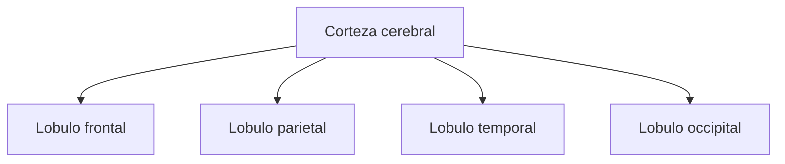

# Lobulos cerebrales

## Que son

Los lobulos son grandes divisiones de la corteza cerebral.

Se nombran historicamente por los huesos del craneo que estan cerca de esas regiones.

## Principales lobulos

- `Frontal`
- `Parietal`
- `Temporal`
- `Occipital`

## Funciones asociadas de forma general

- `Frontal`: planificacion, control, movimiento voluntario, funciones ejecutivas.
- `Parietal`: integracion sensorial, espacio, tacto.
- `Temporal`: audicion, memoria, lenguaje en varios contextos.
- `Occipital`: vision.

## Cuidado

No conviene pensar que cada lobulo hace una sola cosa de manera aislada.

El profesor probablemente aclaro que hay funciones mas asociadas a ciertas zonas, pero el cerebro trabaja por redes y conexiones.

## Idea clave

Los lobulos sirven como mapa general. No son cajas cerradas e independientes.
