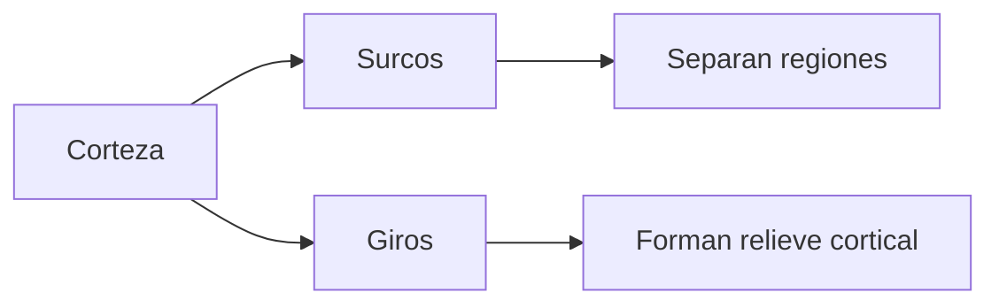

# Surcos, giros y otras formas de describir la corteza

## Otra forma de describir el cerebro

El cerebro no solo se describe por lobulos.

Tambien se puede describir por la forma de su superficie:

- `Surcos`: hendiduras o pliegues.
- `Giros`: elevaciones o pliegues salientes entre surcos.

## Por que importa

Muchos limites anatomicos se reconocen por estos pliegues.

Es decir, no siempre se ubica una region diciendo solo "esta en el lobulo frontal", sino tambien usando surcos y giros concretos.

## Relacion con la clase

Esto conecta con lo que anotaste: otra forma de describir el cerebro no es solo por lobulos, sino por categorias basadas en las "arrugas" de la corteza.

Esas arrugas no son un detalle estetico. Ayudan a organizar el mapa anatomico.

## Idea clave

`Lobulos`, `surcos` y `giros` son maneras complementarias de describir la corteza cerebral.
