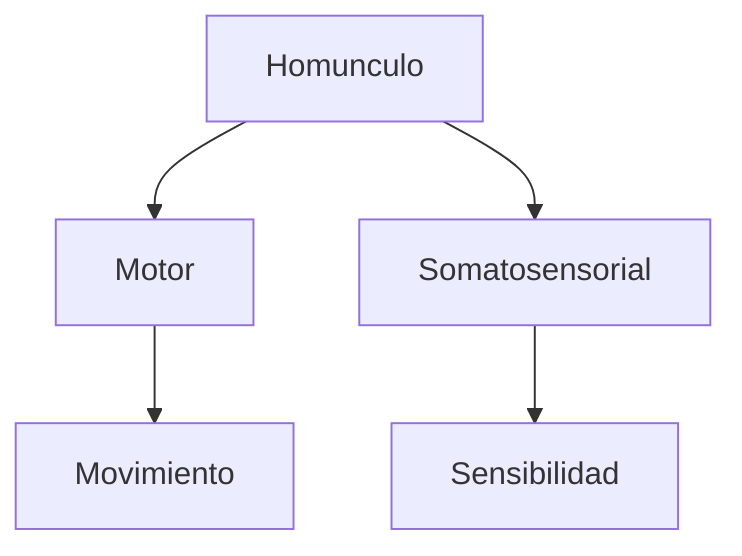

# Homunculo motor y somatosensorial

## Que significa `homunculo`

El `homunculo` es un dibujo que representa como el cuerpo aparece "mapeado" en la corteza cerebral.

No es un hombrecito real dentro del cerebro. Es una forma visual de mostrar que distintas partes del cuerpo ocupan distintas cantidades de corteza.

## Idea central

No todas las partes del cuerpo tienen la misma representacion cortical.

Por eso, en el homunculo:

- las `manos` aparecen muy grandes
- la `cara`, `labios` y `lengua` aparecen muy grandes
- otras zonas aparecen mas pequenas

Eso no significa que esas partes sean fisicamente mas grandes. Significa que el cerebro les dedica mas tejido cortical.

## Dos homunculos

Hay que distinguir dos mapas:

- `Homunculo motor`: muestra como esta organizado el control del movimiento voluntario.
- `Homunculo somatosensorial`: muestra como esta organizada la sensibilidad corporal.

## Donde se ubican

- El `homunculo motor` se relaciona con la `corteza motora primaria`.
- El `homunculo somatosensorial` se relaciona con la `corteza somatosensorial primaria`.

Estas regiones estan muy cerca una de otra.

## Por que algunas partes salen enormes

Una parte del cuerpo aparece mas grande cuando necesita:

- movimientos muy finos
- mucha precision
- mucha sensibilidad

Por eso las manos y la cara suelen ocupar tanto espacio en estos mapas.

## Lo que suele confundir

No significa:

- que haya un muneco literal dentro del cerebro
- que el tamano en el dibujo sea el tamano real del cuerpo
- que el cerebro tenga una copia anatomica exacta del cuerpo

Significa que hay una `representacion cortical desproporcionada`.

## Relacion simple

\[
\text{tamano en el homunculo} \neq \text{tamano real del cuerpo}
\]

\[
\text{tamano en el homunculo} \approx \text{cantidad de representacion cortical}
\]

## Para estudiar

Pregunta tipica: por que la mano aparece enorme en el homunculo.

Respuesta corta:

Porque necesita mucho control fino y mucha representacion cortical.

## Idea clave

El homunculo muestra que el cerebro no representa el cuerpo de forma uniforme. Representa mas intensamente lo que requiere mas sensibilidad o mas precision.
