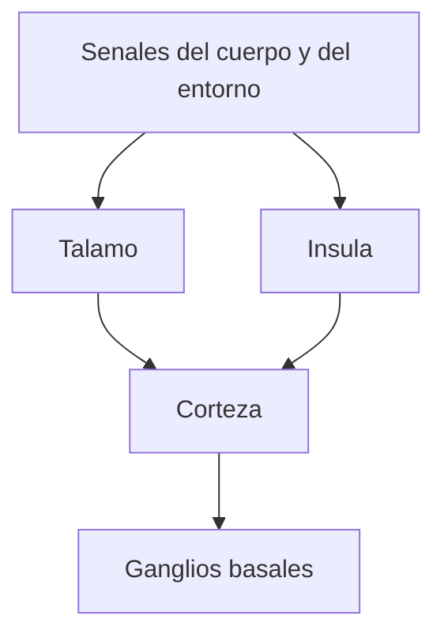

# Ganglios basales, talamo e insula

## Idea general

La tercera clase deja claro que el cerebro no puede entenderse solo desde la corteza.

Tambien hay estructuras subcorticales que organizan seleccion, relevo, integracion y senales corporales.

## Ganglios basales

En tus notas aparecen:

- `nucleo caudado`;
- `putamen`;
- `globo palido`.

La idea mas importante es que los ganglios basales participan en:

- seleccion de acciones;
- inicio y ajuste del movimiento;
- automatizacion de secuencias;
- control de fuerza y oportunidad de respuesta.

No son solo motores en sentido estrecho. Tambien ayudan a estabilizar rutinas cognitivas.

## Talamo

El talamo funciona como una estacion de relevo y distribucion.

Eso significa que:

- recibe mucha informacion aferente;
- la organiza;
- la envia a distintas areas corticales;
- ayuda a coordinar trafico sensorial y parte del procesamiento motor.

## Insula

La insula es importante para:

- interocepcion;
- integracion de estados corporales;
- relacion entre cuerpo, sensacion y emocion.

Por eso conecta bien con lo que despues veras en emocion e interocepcion.

## Esquema rapido

## Lo importante para estudiar

- `Talamo`: relevo y distribucion.
- `Ganglios basales`: seleccion y automatizacion.
- `Insula`: cuerpo interno e interocepcion.

## Pregunta tipica

Pregunta: por que estas estructuras importan filosoficamente.

Respuesta corta:

- porque muestran que percepcion, accion y emocion dependen de circuitos amplios, no solo de una corteza aislada.
